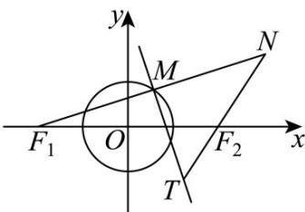
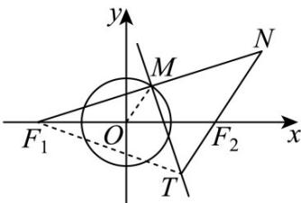
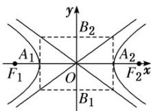

## 知识点 04 双曲线的定义

满足以下三个条件的点的轨迹是双曲线

(1)在平面内；

(2)动点到两定点的距离的差的绝对值为一定值；

(3)这一定值一定要小于两定点的距离.

【即学即练】

1．如图，已知 $F_{1}(-2,0)$ ， $F_{2}(2,0)$ ，M是圆 $O:x^{2}+y^{2}=1$ 上任意一点，点 $F_{1}$ 关于点M的对称点为N，线段 $F_{1}N$ 的垂直平分线与直线 $F_{2}N$ 相交于点T，记点T的轨迹为曲线E，若点 $(1,m)$ 在曲线E上，则m=（）

A. 0 B. $\frac{1}{2}$ C. 1 D. $\sqrt{2}$

【答案】A

【详解】如图，连接 $OM$ ，由题意可得 $\left|OM\right| = 1$ ，且 $M$ 为 $NF_{1}$ 的中点，

又 $O$ 为 $F_{1}F_{2}$ 的中点，所以 $OM\parallel NF_{2}$ 且 $\left|NF_2\right| = 2\left|OM\right| = 2$

连接 $TF_{1}$ ，因为点 $F_{1}$ 关于点M的对称点为N，

线段 $F_{1}N$ 的垂直平分线与直线 $F_{2}N$ 相交于点 T ，

由垂直平分线的性质可得 $\left|TN\right|=\left|TF_{1}\right|$

所以 $\left\| TF_2\right| - \left|TF_1\right\| = \left\| TF_2\right| - \left|TN\right\| = \left|NF_2\right| = 2 <   \left|F_1F_2\right| = 4$

所以点 $T$ 的轨迹是以 $F_{1}, F_{2}$ 为焦点的双曲线， $a = 1$ ， $c = \frac{1}{2} |F_{1}F_{2}| = 2$ ，

所以 $b^{2} = c^{2} - a^{2} = 3$ ，所以曲线 $E$ 的方程为 $x^{2} - \frac{y^{2}}{3} = 1$

令 $x = 1$ 可得 $y = 0$ ，即 $m = 0$

2. 双曲线 $x^{2}-\frac{y^{2}}{16}=1$ 上一点 P 到它的一个焦点的距离为 4，那么点 P 到另一个焦点的距离为（）
A. 2 B. 6 C. 2 或 6 D. 4

【答案】B

【详解】双曲线 $x^{2}-\frac{y^{2}}{16}=1$ ，a=1。

设双曲线的两个焦点为 $F_{1}$ ， $F_{2}$ ，已知 $\left|PF_1\right| = 4$ ，由双曲线定义 $\left\| PF_1\right| - \left|PF_2\right| = 2a = 2\times 1 = 2$ ，即 $\left|4 - \left|PF_2\right| = 2\right.$ 当 $4 - \left|PF_{2}\right| = 2$ 时，可得 $\left|PF_2\right| = 4 - 2 = 2$

当 $4 - |PF_{2}| = -2$ 时，可得 $|PF_{2}| = 4 + 2 = 6$ 所以 $|PF_{2}| = 6$ 或2.

在双曲线中，双曲线上的点到焦点的距离存在最小值，这个最小值为 c-a.

对于双曲线 $\frac{x^2}{1^2} -\frac{y^2}{4^2} = 1$ ，可得 $c = \sqrt{1^2 + 4^2} = \sqrt{1 + 16} = \sqrt{17}$

那么 $c - a = \sqrt{17} - 1$ ，因为 $\sqrt{16} = 4$ ， $\sqrt{17} > \sqrt{16}$ ，所以 $\sqrt{17} - 1 > 4 - 1 = 3 > 2$ 。

这就说明双曲线上的点到焦点的距离不可能为 2，所以要舍去 $\left|PF_{2}\right|=2$ 这个值.

因此 $\left|PF_{2}\right|=6$ ，即点 P 到另一个焦点的距离等于 6 .

故选：B

知识点 05 双曲线的方程及简单几何性质

<table><tr><td colspan="2">标准方程</td><td>- =1(a&gt;0,b&gt;0)</td><td>- =1(a&gt;0,b&gt;0)</td></tr><tr><td rowspan="9">性质</td><td>图形</td><td></td><td></td></tr><tr><td>焦点</td><td> $F_1(-c,0),F_2(c,0)$ </td><td> $F_1(0,-c),F_2(0,c)$ </td></tr><tr><td>焦距</td><td colspan="2"> $|F_1F_2|=2c$ </td></tr><tr><td>范围</td><td>x≤ -a或 x≥a,y∈</td><td>y≤ -a或 y≥a,x∈</td></tr><tr><td>对称性</td><td colspan="2">对称轴:坐标轴;对称中心:原点</td></tr><tr><td>顶点</td><td> $A_1(-a,0),A_2(a,0)$ </td><td> $A_1(0,-a),A_2(0,a)$ </td></tr><tr><td>轴</td><td colspan="2">实轴:线段  $A_1A_2$ ,长: ;虚轴:线段  $B_1B_2$ ,长: ;半实轴长:,半虚轴长:</td></tr><tr><td>离心率</td><td colspan="2">e= ∈(1,+∞)</td></tr><tr><td>渐近线</td><td>y= ±x</td><td>y= ±x</td></tr></table>
