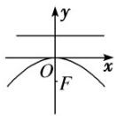

## 知识点 08 抛物线的方程及简单几何性质

<table><tr><td colspan="2">类型</td><td> $y^{2} = 2px(p>0)$ </td><td> $y^{2} = -2px(p>0)$ </td><td> $x^{2} = 2py(p>0)$ </td><td> $x^{2} = -2py(p>0)$ </td></tr><tr><td colspan="2">图象</td><td></td><td></td><td></td><td></td></tr><tr><td rowspan="4">性质</td><td>焦点</td><td>F</td><td>F</td><td>F</td><td>F</td></tr><tr><td>准线</td><td>x = -</td><td>x =</td><td>y = -</td><td>y =</td></tr><tr><td>范围</td><td> $x \geq 0, y \in R$ </td><td> $x \leq 0, y \in R$ </td><td> $x \in R, y \geq 0$ </td><td> $x \in R, y \leq 0$ </td></tr><tr><td>对称轴</td><td colspan="2">x 轴</td><td colspan="2">y 轴</td></tr><tr><td rowspan="3"></td><td>顶点</td><td colspan="4">O(0,0)</td></tr><tr><td>离心率</td><td colspan="4">e=1</td></tr><tr><td>开口方向</td><td>向右</td><td>向左</td><td>向上</td><td>向下</td></tr></table>
