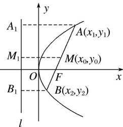
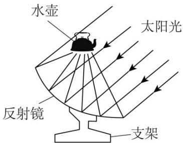
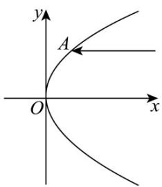

## 知识点 09 抛物线的弦长问题

过抛物线 $y^{2} = 2px(p > 0)$ 的焦点的直线交抛物线于 $A(x_{1},y_{1})$ ， $B(x_{2},y_{2})$ 两点，那么线段 $AB$ 叫做焦点弦，

如图：设 $AB$ 是过抛物线 $y^{2} = 2px(p > 0)$ 焦点 $F$ 的弦，若 $A(x_{1},y_{1})$ ， $B(x_{2},y_{2})$ ，则 $\vert AB\vert = x_1 + x_2 + p.$ 注：(1) $x_{1}\cdot x_{2} =$ ：

(2) $y_{1}\cdot y_{2}=-p^{2}.$

(3) $|AB|=x_{1}+x_{2}+p=(\alpha$ 是直线AB的倾斜角).

(4) + = 为定值(F 是抛物线的焦点).

## (5) 求弦长问题的方法

①一般弦长： $|AB|=|x_{1}-x_{2}|$ ，或 $|AB|=|y_{1}-y_{2}|$ .

②焦点弦长：设过焦点的弦的端点为 $A(x_{1},y_{1})$ ， $B(x_{2},y_{2})$ ，则 $\vert AB\vert = x_1 + x_2 + p.$

【即学即练】

1. 若抛物线 $y = \frac{1}{2} x^2$ 的准线为直线 $l$ ，则 $l$ 截圆 $C: x^2 + y^2 = 1$ 所得的弦长为（）
A. $\sqrt{3}$ B. $\frac{\sqrt{3}}{2}$ C. $\frac{3\sqrt{7}}{4}$ D. $\frac{3\sqrt{7}}{8}$

【答案】A

【详解】抛物线 $x^{2} = 2y$ 的准线方程为 $y = -\frac{1}{2}$

圆 C 的圆心为原点，半径为 1 ，圆心到直线 l 的距离为 $d = \frac{1}{2}$

所以， $l$ 截圆 $C$ 所得的弦长为 $2\sqrt{1 - \left(\frac{1}{2}\right)^2} = \sqrt{3}$

故选：A.

2. 抛物线绕它的对称轴旋转所得到的曲面叫抛物面，用于加热水和水壶食物的太阳灶应用了抛物线的光学性

质：一束平行于抛物线对称轴的光线，经过抛物面的反射后，集中于它的焦点·已知一束平行于 $x$ 轴的入射光

线的一束光线与抛物线 $y^{2} = 2px$ 的交点为 $A(4,4)$ ，则反射光线所在直线被抛物线截得的弦长为（）

A. $\frac{27}{4}$ B. $\frac{21}{4}$ C. $\frac{25}{4}$ D. $\frac{29}{4}$

【答案】C

【详解】因为点 $A(4,4)$ 在抛物线上，所以 $16 = 8p$ ，解得 $p = 2$

所以抛物线的方程为 $y^{2}=4x$ ，则焦点为 $F(1,0)$ ，

又因为反射光线经过点 $A(4,4)$ 及焦点 $F(1,0)$ ， $k_{AB} = k_{AF} = \frac{4 - 0}{4 - 1} = \frac{4}{3}$ ，

所以反射光线 $AB$ 的方程为 $y=\frac{4}{3}(x-1)$

联立抛物线方程得 $\left\{ \begin{array}{l} y^{2} = 4x \\ y = \frac{4}{3} (x - 1) \end{array} \right.$ ，解得 $\left\{ \begin{array}{l} x = 4 \\ y = 4 \end{array} \right.$ 或 $\left\{ \begin{array}{l} x = \frac{1}{4} \\ y = -1 \end{array} \right.$ ，

所以反射光线 $AB$ 与抛物线的交点为 $B(\frac{1}{4}, -1)$ ，

由两点间距离公式可得 $|AB| = \sqrt{(4 - \frac{1}{4})^2 + (4 + 1)^2} = \frac{25}{4}$

所以反射光线所在直线被抛物线截得的弦长为 $\frac{25}{4}$ .

故选：C.
