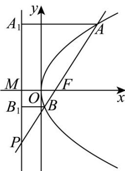

> [!faq]- 《第三章_圆锥曲线的方程_高效培优讲义_》官方解析
>
> > [!success]- **【答案】** C
>
> > [!note]- **【解析】**
> > 记 C 的准线与 x 轴交点为 M，过 A, B 分别作准线的垂线，垂足为 $A_{1}, B_{1}$ ，因为 $PB = 3BF$ ，所以 $\left|PB\right| = 3\left|BF\right|$ ，即 $\left|PB\right| = 3\left|BB_{1}\right|$ ，
> > 由于 $\left|AF\right|=3$ ，所以 $\left|AA_{1}\right|=3$ ，
> > 由 $\triangle PBB_{1}-\triangle PAA_{1}$ 可知 $\left|PA\right|=9$ ，所以 $\left|PF\right|=6$ ，而 $\left|FM\right|=p$ ，
> > 由 $\triangle PFM-\triangle PBB_{1}$ 可知 $p=\left|FM\right|=2$ ，即 C 的方程为 $y^{2}=4x$ 。故 C 正确。
> >
> > 故选：C.
> >
> > 
