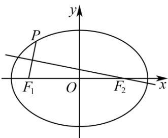

## 题型03 圆锥曲线的几何性质

【典例1】如图，设 $F_{1}$ ， $F_{2}$ 分别是椭圆 $C:\frac{x^2}{a^2} +\frac{y^2}{b^2} = 1(a > b > 0)$ 的左、右焦点，若椭圆 $C$ 上存在点 $P$ ，使得线

段 $PF_{1}$ 的中垂线恰好过焦点 $F_{2}$ ，则椭圆 $C$ 的离心率的取值范围是（）

A. $\left[\frac{1}{2}, 1\right)$ B. $\left[\frac{1}{3}, 1\right)$ C. $\left[\frac{1}{4}, 1\right)$ D. $\left[\frac{1}{5}, 1\right)$

【答案】B

【详解】解法一：因为线段 $PF_{1}$ 的中垂线恰好过焦点 $F_{2}$ ，所以 $\left|PF_{2}\right| = \left|F_{1}F_{2}\right| = 2c$

由焦半径的范围可知 $a - c \leq \left|PF_{2}\right| \leq a + c$ ，即 $a - c \leq 2c \leq a + c$

则 $a \leq 3c$ 且 $c \leq a$ ，解得 $\frac{1}{3} \leq e \leq 1$

又 $0 < e < 1$ ，可得 $\frac{1}{3} \leq e < 1$

故选：B.

解法二：设 $P\left(x_0,y_0\right)$ ，则线段 $PF_{1}$ 的中点坐标为 $\left(\frac{x_0 - c}{2},\frac{y_0}{2}\right)$ ， $k_{PF_1} = \frac{y_0}{x_0 + c}$

可得线段 $PF_{1}$ 的中垂线所在的直线方程为 $y - \frac{y_0}{2} = -\frac{x_0 + c}{y_0}\left(x - \frac{x_0 - c}{2}\right)$

把点 $F_{2}(c,0)$ 代入得 $c^{2}x_{0}^{2}-2ca^{2}x_{0}+b^{2}a^{2}-3a^{2}c^{2}=0$

从而得到 $\left(cx_{0}-a^{2}\right)^{2}=4a^{2}c^{2}$ ，则 $x_{0}=\frac{a^{2}-2ac}{c}$ 或 $x_{0}=\frac{a^{2}+2ac}{c}$ （舍去），

因为 $-a \leq x_0 \leq a$ ，所以 $-a \leq \frac{a^2 - 2ac}{c} \leq a$

则 $a \leq 3c$ 且 $c \leq a$ ，解得 $\frac{1}{3} \leq e \leq 1$

又因为 $0 < e < 1$ ，得 $\frac{1}{3} \leq e < 1$

故选：B.

【典例2】已知双曲线 $\Gamma$ 的方程为 $x^{2} - \frac{y^{2}}{3} = 1$ ， $F_{1}$ ， $F_{2}$ 分别为其左、右焦点， $P(x_0,y_0)$ 为右支上一点，

$\angle F_{1}PF_{2}$ 的平分线交 $x$ 轴于点 $M(m,0)$ ，则 $x_0 + 2m$ 的最小值为（）A.1 B.2 C. $2\sqrt{2}$ D.3

【答案】C

【详解】由题意有 $a = 1, b = \sqrt{3}. c = \sqrt{a^2 + b^2} = 2, e = \frac{c}{a} = 2$

解法 1： $\left|PF_{2}\right|=\sqrt{\left(x_{0}-c\right)^{2}+y_{0}^{2}}=\frac{c}{a}x_{0}-a=2x_{0}-1$ ，同理， $\left|PF_{1}\right|=\frac{c}{a}x_{0}+a=2x_{0}+1$

又 $\frac{|PF_1|}{|F_1M|} = \frac{|PF_2|}{|F_2M|}$ ，进而得 $mx_0 = 1$ ，所以 $x_0 + 2m = x_0 + \frac{2}{x_0} 2\sqrt{2}$ ，又 $x_0$ 1，

所以当且仅当 $x_0 = \sqrt{2}$ 时等号成立.

故选：C.

解法2：由角平分线的性质可知，点 $M$ 到直线 $PF_{1}$ 和 $PF_{2}$ 的距离相等.

因为 $PF_{1}:(x_{0}+2)y-y_{0}x-2y_{0}=0,\quad PF_{2}:(x_{0}-2)y-y_{0}x+2y_{0}=0$

所以 $\frac{\left|y_0m + 2y_0\right|}{\sqrt{(x_0 + 2)^2 + y_0^2}} = \frac{\left| - y_0m + 2y_0\right|}{\sqrt{(x_0 - 2)^2 + y_0^2}}$ ，解得 $mx_{0} = 1$ ，所以 $x_0 + 2m = x_0 + \frac{2}{x_0}$ $2\sqrt{2}$ 又 $x_0 = 1$ ，所以当且仅当 $x_0 = \sqrt{2}$ 时等号成立.

故选：C.

## 方法技巧

1. 关于椭圆几何性质的考查，主要有四类问题，一是考查椭圆中的基本量 a, b, c；二是考查椭圆的离心率；三是考查离心率发最值或范围；四是其它综合应用。

2. 学习中，要注意椭圆几何性质的挖掘：

(1)椭圆中有两条对称轴，“六点”(两个焦点、四个顶点)，要注意它们之间的位置关系(如焦点在长轴上等)以及

相互间的距离(如焦点到相应顶点的距离为 a - c)，过焦点垂直于长轴的通径长等。

(2)设椭圆 $\frac{x^2}{a^2} +\frac{y^2}{b^2} = 1(a > b > 0)$ 上任意一点 $P(x,y)$ ，则当 $x = 0$ 时， $|OP|$ 有最小值 $b$ ，这时， $P$ 在短轴端点处；当 $x = a$ 时， $|OP|$ 有最大值 $a$ ，这时 $P$ 在长轴端点处.

(3)椭圆上任意一点 $P(x, y)(y \neq 0)$ 与两焦点 $F_{1}(-c, 0), F_{2}(c, 0)$ 构成的 $\triangle PF_{1}F_{2}$ 称为焦点三角形，其周长为 $2(a + c)$ .

(4)椭圆的一个焦点、中心和短轴的一个端点构成直角三角形，其中 $a$ 是斜边， $a^2 = b^2 + c^2$ .

3. 重视向量在解析几何中的应用，注意合理运用中点、对称、弦长、垂直等几何特征。

4．已知双曲线方程讨论其几何性质，应先将方程化为标准形式，找出对应的 a、b，利用 $c^{2}=a^{2}+b^{2}$ 求出 c，再按定义找出其焦点、焦距、实轴长、虚轴长、离心率、渐近线方程．

5．画双曲线图形，要先画双曲线的两条渐近线(即以2a、2b为两邻边的矩形对角线)和两个顶点，然后根据双曲线的变化趋势，就可画出双曲线的草图．

6. 求抛物线的焦点及准线方程的步骤：

(1)把抛物线解析式化为标准方程形式；

(2)明确抛物线开口方向；

(3)求出抛物线标准方程中参数 $p$ 的值；

(4)写出抛物线的焦点坐标或准线方程.

![[高中/课堂同步/题库/人教A版高中数学同步讲义(2026)/03_选择性必修第一册/第三章 圆锥曲线的方程/讲义/第三章_圆锥曲线的方程_高效培优讲义_/题型03_圆锥曲线的几何性质_sec_17/questions/Q00063206.md]]
![[高中/课堂同步/题库/人教A版高中数学同步讲义(2026)/03_选择性必修第一册/第三章 圆锥曲线的方程/讲义/第三章_圆锥曲线的方程_高效培优讲义_/题型03_圆锥曲线的几何性质_sec_17/questions/Q00063207.md]]
![[高中/课堂同步/题库/人教A版高中数学同步讲义(2026)/03_选择性必修第一册/第三章 圆锥曲线的方程/讲义/第三章_圆锥曲线的方程_高效培优讲义_/题型03_圆锥曲线的几何性质_sec_17/questions/Q00063208.md]]
