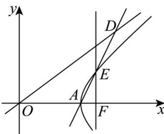

> [!faq]- 《第三章_圆锥曲线的方程_高效培优讲义_》官方解析
>
> > [!success]- **【答案】** D
>
> > [!note]- **【解析】**
> > 
> >
> > 由题意可得， $A(a,0),E\left(c,\frac{b^{2}}{a}\right)$ . 因为 E 是 AD 的中点，所以 $D\left(2c-a,\frac{2b^{2}}{a}\right)$ ，
> > 经过第一象限的渐近线方程为 $y=\frac{b}{a}x$ ，所以 $\frac{2b^{2}}{a}=\frac{b}{a}(2c-a)$ ，所以 $e=\frac{c}{a}=\frac{5}{4}$ .
> >
> > 故选 **D**.
