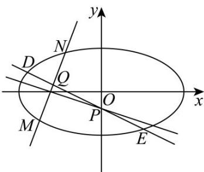

> [!faq]- 《第三章_圆锥曲线的方程_高效培优讲义_》官方解析
>
> > [!success]- **【答案】** (1) $\frac{x^{2}}{3}+\frac{y^{2}}{2}=1$ (2)证明见解析
>
> > [!note]- **【解析】**
> > （1）由题设 $c = 1$ ，因为点A在椭圆上，所以 $2a = \left|AF_1\right| + \left|AF_2\right|$
> >
> > $$
> > 2 a = \sqrt {\left[ \frac {3}{2} - (- 1) \right] ^ {2} + \left(0 + \frac {\sqrt {2}}{2}\right) ^ {2}} + \sqrt {\left(\frac {3}{2} - 1\right) ^ {2} + \left(0 + \frac {\sqrt {2}}{2}\right) ^ {2}} = 2 \sqrt {3}
> > $$
> >
> > 所以 $a = \sqrt{3}$ ， $b^{2} = a^{2} - c^{2} = 2$
> >
> > 所以椭圆 $C$ 的方程为： $\frac{x^2}{3} +\frac{y^2}{2} = 1$
> >
> > (2) 证明：设点 $D, E, M, N$ 的坐标为 $\left(x_{D}, y_{D}\right), \left(x_{E}, y_{E}\right), \left(x_{M}, y_{M}\right), \left(x_{N}, y_{N}\right)$
> >
> > 当直线 DE, MN 的斜率都存在时，
> >
> > 令 $DE$ 为 $x = ky - 1$ ，代入 $C:\frac{x^2}{3} +\frac{y^2}{2} = 1$
> >
> > 整理得： $\left(2k^2 +3\right)y^2 -4ky - 4 = 0$ ，且 $\Delta = 48(k^2 +1) > 0$
> >
> > 所以 $y_{D} + y_{E} = \frac{4k}{2k^{2} + 3}$ ，则 $x_{D} + x_{E} = k(y_{D} + y_{E}) - 2 = -\frac{6}{2k^{2} + 3}$
> >
> > 故 $P\left(-\frac{3}{2k^2 + 3}, \frac{2k}{2k^2 + 3}\right)$
> >
> > 由 $DE \cdot MN = 0$ ，即 $DE \perp MN$ ，
> >
> > 故MN为 $x = -\frac{y}{k} -1$ ，代入 $C:\frac{x^2}{3} +\frac{y^2}{2} = 1$
> >
> > 所以 $\left(\frac{2}{k^{2}}+3\right)y^{2}+\frac{4}{k}y-4=0$ ，有 $y_{M}+y_{N}=-\frac{4k}{2+3k^{2}}$
> >
> > 则 $x_{M} + x_{N} = -\frac{y_{M} + y_{N}}{k} -2 = -\frac{6k^{2}}{2 + 3k^{2}}$ ，故 $Q\left(-\frac{3k^2}{2 + 3k^2}, - \frac{2k}{2 + 3k^2}\right)$
> >
> > 当 $k \neq \pm 1$ 时，
> >
> > 所以 $k_{PQ}=\frac{5k}{3(k^{2}-1)}$ ，则 PQ 为 $y-\frac{2k}{2k^{2}+3}=\frac{5k}{3(k^{2}-1)}\left(x+\frac{3}{2k^{2}+3}\right)$
> >
> > 整理得 $k(3 + 5x) = 3(k^2 - 1)y$ ，所以 $PQ$ 过定点 $\left(-\frac{3}{5}, 0\right)$
> >
> > 当 $k = 1$ 时， $P\left(-\frac{3}{5}, \frac{2}{5}\right)$ ， $Q\left(-\frac{3}{5}, -\frac{2}{5}\right)$ ， $PQ$ 过点 $\left(-\frac{3}{5}, 0\right)$
> >
> > 当 $k = -1$ 时， $P\left(-\frac{3}{5}, -\frac{2}{5}\right)$ ， $Q\left(-\frac{3}{5}, \frac{2}{5}\right)$ ， $PQ$ 过点 $\left(-\frac{3}{5}, 0\right)$
> >
> > 当一条直线斜率不存在时， $P,Q$ 对应 $O$ ， $F_{1}$ ，故 $PQ$ 即为 $x$ 轴，也过点 $\left(-\frac{3}{5},0\right)$
> >
> > 综上，直线 $PQ$ 过定点 $\left(-\frac{3}{5},0\right)$
> >
> > 
