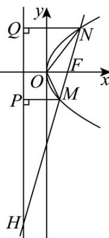

## 题型08 圆锥曲线中的面积问题

【典例1】已知点 $A(-4,0)$ ， $C,D$ 是 $\odot O:x^{2} + y^{2} = 25$ 与 $x$ 轴的交点， $P$ 为动点，以 $PA$ 为直径的圆与 $\odot O$ 相内切，则 $\triangle CPD$ 面积的最大值为（）A.8 B.10 C.12 D.15

【答案】D

【详解】如图，设以 PA 为直径的圆心为 E，半径为 r，

因为 $\odot E$ 与 $\odot O$ 相内切，则 $|OE| = 5 - r$

设 $F(4,0)$ ，连接 $PF$ ，则 $\left|OE\right| = \frac{1}{2}\left|PF\right|$

$$
\therefore \left| P F \right| = 2 \left| O E \right| = 1 0 - 2 r, \text {又} \left| P A \right| = 2 r
$$

所以， $\left|PA\right|+\left|PF\right|=10>8$

所以，点 $P$ 的轨迹是以 $A$ ， $F$ 为焦点的椭圆，

由 $2a = 10$ ，得 $a = 5$ ，又 $c = 4$ ，所以 $b = 3$

显然 $P$ 为椭圆短轴端点即 $(0,3)$ 或 $(0,-3)$ 时 $\triangle CPD$ 的面积最大，为 $\frac{1}{2} |CD| \times 3 = \frac{1}{2} \times 10 \times 3 = 15$

故选：D

【典例2】设 $O$ 为坐标原点，直线 $l: x = ty + 2$ 与抛物线 $C: y^2 = 8x$ 交于 $M, N$ 两点，与 $C$ 的准线交于点 $H$ 。若 $\overline{HM} = 2MN$ ，点 $F$ 为 $C$ 的焦点，则 $\triangle OMF$ 与 $\triangle ONF$ 的面积之比为（）A. $\frac{2}{5}$ B. $\frac{2}{3}$ C. $\frac{3}{4}$ D. $\frac{1}{2}$

【答案】B

【详解】如图，分别过点 $M, N$ 作抛物线 $C$ 的准线的垂线，垂足分别为 $P, Q$ ，则 $\left|MP\right| = \left|MF\right|, \left|NQ\right| = \left|NF\right|$ ， $\triangle HPM \sim \triangle HQN$

抛物线 $C: y^{2} = 8x$ 的焦点 $F(2,0)$ ，直线 $l: x = ty + 2$ 过定点 $F(2,0)$ ，

因为 $\triangle HPM\sim \triangle HQN$ ， $HM = 2MN$ ，所以 $\frac{|PM|}{|QN|} = \frac{|HM|}{|HN|} = \frac{2}{3}$ ，所以 $\frac{S_{\triangle OMF}}{S_{\triangle ONF}} = \frac{|MF|}{|NF|} = \frac{|PM|}{|QN|} = \frac{2}{3}$

故选：B.

![[高中/课堂同步/题库/人教A版高中数学同步讲义(2026)/03_选择性必修第一册/第三章 圆锥曲线的方程/讲义/第三章_圆锥曲线的方程_高效培优讲义_/题型08_圆锥曲线中的面积问题_sec_22/questions/Q00063220.md]]
![[高中/课堂同步/题库/人教A版高中数学同步讲义(2026)/03_选择性必修第一册/第三章 圆锥曲线的方程/讲义/第三章_圆锥曲线的方程_高效培优讲义_/题型08_圆锥曲线中的面积问题_sec_22/questions/Q00063221.md]]
![[高中/课堂同步/题库/人教A版高中数学同步讲义(2026)/03_选择性必修第一册/第三章 圆锥曲线的方程/讲义/第三章_圆锥曲线的方程_高效培优讲义_/题型08_圆锥曲线中的面积问题_sec_22/questions/Q00063222.md]]
