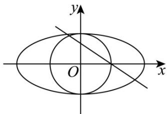
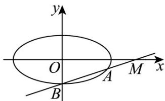

> [!faq]- 《第三章_圆锥曲线的方程_高效培优讲义_》官方解析
>
> > [!success]- **【答案】** (1) $\frac{x^2}{4} + y^2 = 1$ (2) $\left(\frac{10}{3},5\right]$
>
> > [!note]- **【解析】**
> > （1）因为原点到直线 $x+\sqrt{3}y-1=0$ 的距离为 $\frac{1}{2}$ ，
> >
> > 所以 $\left(\frac{1}{2}\right)^{2}+\left(\frac{\sqrt{3}}{2}\right)^{2}=b^{2}$ （b>0），解得b=1。
> >
> > 又 $e^2 = \frac{c^2}{a^2} = 1 - \frac{b^2}{a^2} = \frac{3}{4}$ ，得 $a = 2$
> >
> > 所以椭圆 C 的方程为 $\frac{x^{2}}{4} + y^{2} = 1$
> >
> > 
> >
> > (2) 当直线 l 的斜率为 0 时， $MA \cdot MB = |MA||MB| = 1 \times 5 = 5$
> >
> > 当直线 l 的斜率不为 0 时，设直线 l : $x = my + 3$ ， $A(x_{1}, y_{1})$ ， $B(x_{2}, y_{2})$
> >
> > 联立方程组 $\left\{\begin{aligned}x&=my+3\\ \frac{x^{2}}{4}&+y^{2}=1\end{aligned}\right.$ ，得 $\left(m^{2}+4\right)y^{2}+6my+5=0$ ，
> >
> > 由 $\Delta = 36m^{2} - 20(m^{2} + 4) > 0$ ，得 $m^2 >5$
> >
> > 所以 $y_{1}y_{2}=\frac{5}{m^{2}+4}$ ， $y_{1}+y_{2}=-\frac{6m}{m^{2}+4}$ ，
> >
> > $$
> > M A = \left(x _ {1} - 3, y _ {1}\right), M B = \left(x _ {2} - 3, y _ {2}\right)
> > $$
> >
> > $$
> > M A \cdot M B = (x _ {1} - 3) (x _ {2} - 3) + y _ {1} y _ {2}
> > $$
> >
> > $$
> > = y _ {1} y _ {2} \left(m ^ {2} + 1\right) = \frac {5 m ^ {2} + 5}{m ^ {2} + 4} = 5 - \frac {1 5}{m ^ {2} + 4}
> > $$
> >
> > 由 $m^2 > 5$ ，得 $\frac{10}{3} < 5 - \frac{15}{m^2 + 4} < 5$ ，所以 $\frac{10}{3} < MA \cdot MB < 5$ .
> >
> > 综上可得： $\frac{10}{3}<\overline{MA}\cdot\overline{MB}\leq5$ ，即 $(\frac{10}{3},5]$ .
> >
> > 
