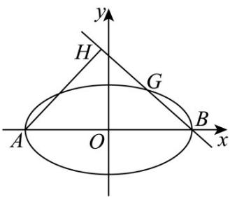

## 题型10 圆锥曲线中的向量问题

【典例1】已知抛物线 $C:y^{2} = 2px(p > 0)$ 的焦点与椭圆 $\frac{x^2}{4} +\frac{y^2}{3} = 1$ 的右焦点重合.

(1)求抛物线 $C$ 的方程；

(2)如图，若过点 $\left(4,0\right)$ 的直线 $l$ 与抛物线 $C$ 交于不同的两点 $A,B,O$ 为坐标原点，证明： $\overline{OA}\perp \overline{OB}$

【答案】(1) $y^{2}=4x$

(2)证明见解析

【详解】（1）设椭圆 $\frac{x^{2}}{4}+\frac{y^{2}}{3}=1$ 的长半轴为 a，短半轴为 b，半焦距为 c，

$\therefore a^{2} = 4, b^{2} = 3$ ，又 $a^{2} = b^{2} + c^{2}$ ， $\therefore c^{2} = 1$ ， $\therefore$ 该椭圆的右焦点为 $(1,0)$

又抛物线 $C:y^{2} = 2px(p > 0)$ 的焦点为 $\left(\frac{p}{2},0\right)$ ，所以 $\frac{p}{2} = 1$ ，解得 $p = 2$

故抛物线 $C$ 的方程为 $y^{2} = 4x$

(2) $\because$ 直线 $l$ 过点 $(4,0)$ 且与抛物线交于不同的两点，故直线 $l$ 的斜率不为 $0$

∴ $l$ 设直线的方程为 $x = my + 4$

联立 $\left\{\begin{aligned}x&=my+4\\ y^{2}&=4x\end{aligned}\right.$ ，得 $y^{2}=4(my+4)$ ，即 $y^{2}-4my-16=0$ ，

方程 $y^{2}-4my-16=0$ 的判别式 $\Delta=16m^{2}+64>0$

设 $A(x_{1},y_{1})$ ， $B(x_{2},y_{2})$ ，则 $x_{1} = \frac{y_{1}^{2}}{4}$ ， $x_{2} = \frac{y_{2}^{2}}{4}$

由根与系数的关系得 $y_{1}y_{2} = -16$

因为 $OA = (x_{1}, y_{1})$ ， $OB = (x_{2}, y_{2})$

所以 $OA \cdot OB = x_{1}x_{2} + y_{1}y_{2} = \frac{(y_{1}y_{2})^{2}}{16} + y_{1}y_{2} = \frac{(-16)^{2}}{16} - 16 = 0$

$$
\therefore O A \perp O B
$$

【典例2】已知椭圆 $C: \frac{x^2}{a^2} + \frac{y^2}{b^2} = 1 (a > b > 0)$ 的离心率为 $\frac{\sqrt{3}}{2}$ ，以椭圆的四个顶点为顶点的四边形的面积为4.

(1)求椭圆 $C$ 的标准方程：

(2)记椭圆 $C$ 的左顶点为A，右顶点为 $B$ ，过点 $B$ 作不垂直于坐标轴的直线 $l$ 交椭圆于另一点 $G$ ，过点A作 $l$ 的

垂线，垂足为 $H$ ，且 $\overline{BG} = \frac{2}{5}\overline{BH}$ ，求直线 $l$ 的方程.

【答案】(1) $\frac{x^2}{4} + y^2 = 1$

(2) $y = x - 2$ 或 $y = -x + 2$

【详解】（1）由题意： $S=\frac{1}{2}\cdot2a\cdot2b=4$ ，所以ab=2，又因为 $\frac{c}{a}=\frac{\sqrt{3}}{2}$ ，所以a=2，b=1，

即椭圆的方程： $\frac{x^2}{4} + y^2 = 1$

(2)

由题意，设直线 $l$ 的方程为 $y = k(x - 2)$ ，设点 $G$ 坐标为 $\left(x_{G},y_{G}\right)$

由 $\left\{\begin{aligned}y&=k(x-2)\\\frac{x^{2}}{4}&+y^{2}=1\end{aligned}\right.$ ，可得 $\left(1+4k^{2}\right)x^{2}-16k^{2}x+16k^{2}-4=0$ ，

由韦达定理得： $2 + x_{G} = \frac{16k^{2}}{1 + 4k^{2}}$ ，所以 $x_{G} = \frac{8k^{2} - 2}{1 + 4k^{2}}$

代入直线方程 $y = k(x - 2)$ 可得： $y_{G} = \frac{-4k}{1 + 4k^{2}}$

过点 $B$ 与 $l$ 垂直的直线方程为 $y = -\frac{1}{k} (x + 2)$

由 $\left\{ \begin{array}{l} y = -\frac{1}{k} (x + 2) \\ y = k(x - 2) \end{array} \right.$ ，设交点 $H$ 坐标为 $\left(x_{H}, y_{H}\right)$ ，可得 $x_{H} = \frac{2k^{2} - 2}{k^{2} + 1}$ ， $y_{H} = \frac{-4k}{k^{2} + 1}$ ，

因为 $\frac{BG}{5} = \frac{2}{5} \frac{BH}{BH}$ ，所以 $(x_{G} - 2, y_{G}) = \frac{2}{5} (x_{H} - 2, y_{H})$

法一： $x_{G} - 2 = \frac{2}{5} (x_{H} - 2)$

所以 $\frac{8k^{2}-2}{1+4k^{2}}-2=\frac{2}{5}\cdot\left(\frac{2k^{2}-2}{k^{2}+1}-2\right)$ ，解得 $k=\pm1$ ，

所以直线 $l$ 的方程： $y = x - 2$ 或 $y = -x + 2$

法二： $y_{G}=\frac{2}{5}y_{H}$

所以 $\frac{-4k}{1+4k^{2}}=\frac{2}{5}\cdot\left(-\frac{4k}{1+k^{2}}\right)$ ，解得 $k=\pm1$ ，

所以直线 l 的方程：y = x - 2 或 $y = -x + 2$

![[高中/课堂同步/题库/人教A版高中数学同步讲义(2026)/03_选择性必修第一册/第三章 圆锥曲线的方程/讲义/第三章_圆锥曲线的方程_高效培优讲义_/题型10_圆锥曲线中的向量问题_sec_24/questions/Q00063226.md]]
![[高中/课堂同步/题库/人教A版高中数学同步讲义(2026)/03_选择性必修第一册/第三章 圆锥曲线的方程/讲义/第三章_圆锥曲线的方程_高效培优讲义_/题型10_圆锥曲线中的向量问题_sec_24/questions/Q00063227.md]]
![[高中/课堂同步/题库/人教A版高中数学同步讲义(2026)/03_选择性必修第一册/第三章 圆锥曲线的方程/讲义/第三章_圆锥曲线的方程_高效培优讲义_/题型10_圆锥曲线中的向量问题_sec_24/questions/Q00063228.md]]
