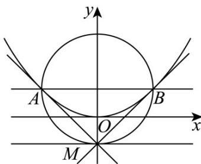

> [!faq]- 《第三章_圆锥曲线的方程_高效培优讲义_》官方解析
>
> > [!success]- **【答案】** (1) $\frac{x^{2}}{4}+y^{2}=1,\quad x^{2}=4y$ (2) (i) 证明见解析, (0,1); (ii) 证明见解析
>
> > [!note]- **【解析】**
> > （1）由题 $\left\{ \begin{array}{l} \frac{c}{a} = \frac{\sqrt{3}}{2} \\ 2a = 4 \\ b^2 = a^2 - c^2 \\ a = 2, b = 1, c = \sqrt{3} \end{array} \right.$ 解得椭圆 $C$ 的方程为 $\frac{x^2}{4} + y^2 = 1$ ，其上顶点坐标为 $(0,1)$ ， $\therefore \frac{p}{2} = 1$ ，即 $p = 2$ 。抛物线 $E$ 的方程为 $x^2 = 4y$ 。
> >
> > (2)
> >
> > 
> >
> > 由（1）知，抛物线 $E$ 的准线方程为 $y = -1$
> >
> > ∴可设 $M(t,-1)$ , $A(x_{1},y_{1})$ , $B(x_{2},y_{2})$
> >
> > (i) 由 $x^{2} = 4y$ 得 $y = \frac{1}{4} x^{2}$ ，且 $y' = \frac{1}{2} x$
> >
> > 又 $x_{1}^{2} = 4y_{1}$
> >
> > $\therefore$ 抛物线 $E$ 在 $A(x_{1},y_{1})$ 处的切线方程为 $y - y_{1} = \frac{1}{2} x_{1}(x - x_{1})$ ，即 $x_{1}x - 2y - 2y_{1} = 0$
> >
> > ∵ $M(t,-1)$ 在切线 $x_{1}x-2y-2y_{1}=0$ 上，
> >
> > $\therefore tx_{1} - 2y_{1} + 2 = 0$ ①同理可得 $tx_{2}-2y_{2}+2=0$ ②，
> >
> > 由①②得直线 $AB$ 的方程为 $tx - 2y + 2 = 0$
> >
> > 令 x = 0 ，则 y = 1 ，
> >
> > 所以直线 $AB$ 恒过抛物线 $E$ 的焦点 $F(0,1)$
> >
> > (ii) 联立 $\left\{\begin{aligned}tx-2y+2&=0\\ x^{2}&=4y\end{aligned}\right.$ 得 $x^{2}-2tx-4=0$
> >
> > $$
> > x _ {1} + x _ {2} = 2 t, y _ {1} + y _ {2} = \frac {t x _ {1} + 2}{2} + \frac {t x _ {2} + 2}{2} = t ^ {2} + 2
> > $$
> >
> > 则线段 AB 的中点为 $N\left(t, \frac{t^{2}+2}{2}\right)$ ， $|AB|=y_{1}+y_{2}+2=t^{2}+4$ ，
> >
> > 又 $x_{M} = x_{N} = t$
> >
> > ∴MN 与抛物线 E 的准线垂直，且 $\left|MN\right|=\frac{t^{2}+2}{2}-(-1)=\frac{t^{2}+4}{2}=\frac{1}{2}\left|AB\right|$
> >
> > 故以线段 $AB$ 为直径的圆与抛物线 $E$ 的准线相切于点 $M$ .
