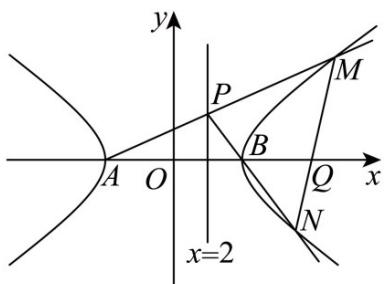

> [!faq]- 《第三章_圆锥曲线的方程_高效培优讲义_》官方解析
>
> > [!success]- **【答案】** (1) $\frac{x^{2}}{9}-y^{2}=1$ (2) $\left(\frac{9}{2},0\right)$
>
> > [!note]- **【解析】**
> > （1）由题意得， $\frac{c}{a}=\frac{\sqrt{10}}{3}$ ， $\frac{18}{a^{2}}-\frac{1}{b^{2}}=1$ ， $c^{2}=a^{2}+b^{2}$ ，
> >
> > 解得 $a^2 = 9, b^2 = 1, c^2 = 10$
> >
> > 故双曲线 C 的方程为 $\frac{x^{2}}{9}-y^{2}=1$
> >
> > (2) 由 (1) 知，双曲线 C 的左顶点 A(-3,0)，右顶点 B(3,0)，
> >
> > 设直线 $x = 2$ 上的动点 $P(2, t)$
> >
> > 于是直线 $PA$ 的斜率 $k_{PA} = \frac{t}{5}$ ，直线 $PA$ 的方程为 $y = \frac{t}{5}(x + 3)$
> >
> > 由 $\left\{\begin{aligned}y&=\frac{t}{5}(x+3)\\ x^{2}&-9y^{2}=9\end{aligned}\right.$ 得， $(25-9t^{2})x^{2}-54t^{2}x-81t^{2}-225=0$ ， $25-9t^{2}\neq0$ ，
> >
> > 设 $M(x_{M},y_{M})$ ，则 $-3x_{M} = \frac{-81t^{2} - 225}{25 - 9t^{2}}$ ，则 $x_{M} = \frac{27t^{2} + 75}{25 - 9t^{2}}$ ， $y_{M} = \frac{t}{5} (x_{M} + 3) = \frac{t}{5}\left(\frac{27t^{2} + 75}{25 - 9t^{2}} + 3\right) = \frac{30t}{25 - 9t^{2}}$
> >
> > 故 $M\left(\frac{27t^2 + 75}{25 - 9t^2}, \frac{30t}{25 - 9t^2}\right)$
> >
> > 直线 $PB$ 的斜率 $k_{PB} = -t$ ，直线 $PB$ 的方程为 $y = -t(x - 3)$
> >
> > 由 $\left\{\begin{aligned}y&=-t(x-3)\\ x^{2}&-9y^{2}=9\end{aligned}\right.$ ，得 $(1-9t^{2})x^{2}+54t^{2}x-81t^{2}-9=0$ ， $1-9t^{2}\neq0$ ，
> >
> > 设 $N(x_{N},y_{N})$ ，则 $3x_{N} = \frac{-81t^{2} - 9}{1 - 9t^{2}}$ ， $x_{N} = \frac{-27t^{2} - 3}{1 - 9t^{2}}$
> >
> > $$
> > y _ {N} = - t \left(x _ {N} - 3\right) = - t \left(\frac {- 2 7 t ^ {2} - 3}{1 - 9 t ^ {2}} - 3\right) = \frac {6 t}{1 - 9 t ^ {2}},
> > $$
> >
> > 则 $N\left(\frac{-27t^2 - 3}{1 - 9t^2}, \frac{6t}{1 - 9t^2}\right)$
> >
> > 由双曲线的对称性知，若直线 MN 过定点，则定点必在 x 轴上，
> >
> > 不妨设这个定点为 $Q(m,0)$
> >
> > $$
> > \text {则} \stackrel {\square \square \square \square} {Q M} = \left(\frac {2 7 t ^ {2} + 7 5}{2 5 - 9 t ^ {2}} - m, \frac {3 0 t}{2 5 - 9 t ^ {2}}\right), \quad \stackrel {\square \square \square} {Q N} = \left(\frac {- 2 7 t ^ {2} - 3}{1 - 9 t ^ {2}} - m, \frac {6 t}{1 - 9 t ^ {2}}\right)
> > $$
> >
> > 因 $QM//QN$ ，则 $\left(\frac{27t^{2}+75}{25-9t^{2}}-m\right)\cdot\frac{6t}{1-9t^{2}}=\left(\frac{-27t^{2}-3}{1-9t^{2}}-m\right)\cdot\frac{30t}{25-9t^{2}}$
> >
> > 当 $t \neq 0$ 时，整理得 $(9 - 2m)(9t^2 + 5) = 0$ ，解得 $m = \frac{9}{2}$ ，则直线 $MN$ 过点 $Q\left(\frac{9}{2}, 0\right)$
> >
> > 当 $t = 0$ 时，直线 $MN$ 与 $x$ 轴重合，直线 $MN$ 也过点 $Q\left(\frac{9}{2},0\right)$
> >
> > 所以直线MN经过定点 $Q\left(\frac{9}{2},0\right)$
> >
> > 
