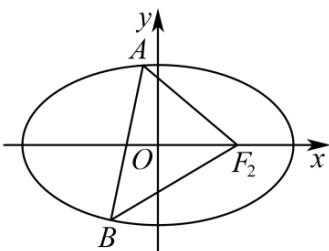

## 题型11 圆锥曲线中的定点问题

【典例1】如图，已知椭圆 $C: \frac{x^2}{2} + y^2 = 1$ ，不经过右焦点 $F_2$ 的直线 $l: y = kx + m (m \neq 0)$ 交椭圆于 $\mathrm{A}$ ， $B$ 两点。若

$x$ 轴上任意一点到直线 $AF_{2}$ ， $BF_{2}$ 的距离相等，求证：直线 $l$ 过定点.

【答案】证明见解析

【详解】联立 $\left\{\begin{aligned}y&=kx+m,\\ \frac{x^{2}}{2}&+y^{2}=1,\end{aligned}\right.$ 得 $\left(1+2k^{2}\right)x^{2}+4kmx+2m^{2}-2=0$

设 $A\left(x_{1},y_{1}\right)$ ， $B\left(x_{2},y_{2}\right)$ ，则 $x_{1} + x_{2} = -\frac{4km}{1 + 2k^{2}}$ ， $x_{1}x_{2} = \frac{2m^{2} - 2}{1 + 2k^{2}}$

由题意得直线 $AF_{2}$ ， $BF_{2}$ 的倾斜角互补，即 $k_{AF_{2}} + k_{BF_{2}} = 0$ ，

所以 $\frac{y_1}{x_1 - 1} +\frac{y_2}{x_2 - 1} = \frac{kx_1 + m}{x_1 - 1} +\frac{kx_2 + m}{x_2 - 1} = \frac{2kx_1x_2 + (m - k)(x_1 + x_2) - 2m}{(x_1 - 1)(x_2 - 1)} = 0$

$$
2 k x _ {1} x _ {2} + (m - k) \left(x _ {1} + x _ {2}\right) - 2 m = \frac {4 k m ^ {2} - 4 k}{1 + 2 k ^ {2}} - \frac {4 k m (m - k)}{1 + 2 k ^ {2}} - 2 m
$$

$= \frac{-4k - 2m}{1 + 2k^2} = 0$ ，解得 $m = -2k$

所以直线 l 的方程为 $y = kx - 2k$

故直线 $l$ 恒过定点 $(2,0)$

![[高中/课堂同步/题库/人教A版高中数学同步讲义(2026)/03_选择性必修第一册/第三章 圆锥曲线的方程/讲义/第三章_圆锥曲线的方程_高效培优讲义_/题型11_圆锥曲线中的定点问题_sec_25/questions/Q00063229.md]]
![[高中/课堂同步/题库/人教A版高中数学同步讲义(2026)/03_选择性必修第一册/第三章 圆锥曲线的方程/讲义/第三章_圆锥曲线的方程_高效培优讲义_/题型11_圆锥曲线中的定点问题_sec_25/questions/Q00063230.md]]
![[高中/课堂同步/题库/人教A版高中数学同步讲义(2026)/03_选择性必修第一册/第三章 圆锥曲线的方程/讲义/第三章_圆锥曲线的方程_高效培优讲义_/题型11_圆锥曲线中的定点问题_sec_25/questions/Q00063231.md]]
