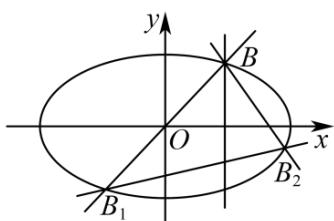

## 题型12 圆锥曲线中的定值问题

【典例1】如图，已知椭圆 $C: \frac{x^2}{4} + \frac{y^2}{3} = 1$ ， $B_1$ ， $B_2$ 是椭圆上的两个动点， $B\left(1, \frac{3}{2}\right)$ ，直线 $BB_1$ ， $BB_2$ 关于直线

$x = 1$ 对称，求证：直线 $B_{1}B_{2}$ 的斜率为定值.

【答案】证明见解析

【详解】因为 $\frac{1^2}{4} +\frac{\left(\frac{3}{2}\right)^2}{3} = 1$ ，点 $B\left(1,\frac{3}{2}\right)$ 在椭圆上，直线 $BB_{1}$ ， $BB_{2}$ 的斜率都存在，

设直线 $BB_{1}$ ， $BB_{2}$ 的方程分别为 $y = k(x - 1) + \frac{3}{2}$ ， $y = -k(x - 1) + \frac{3}{2}$ ，

$$
B _ {1} \left(x _ {1}, y _ {1}\right) \quad B _ {2} \left(x _ {2}, y _ {2}\right)
$$

联立 $\left\{ \begin{array}{l} y = k(x - 1) + \frac{3}{2} \\ \frac{x^2}{4} + \frac{y^2}{3} = 1 \end{array} \right.$ ，得 $(3 + 4k^2)x^2 + 4k(3 - 2k)x + 4k^2 - 12k - 3 = 0$

解得 $x_{1} = \frac{4k^{2} - 12k - 3}{4k^{2} + 3}$ ，同理得 $x_{2} = \frac{4k^{2} + 12k - 3}{4k^{2} + 3}$

所以 $x_{2}+x_{1}=\frac{4k^{2}+12k-3}{4k^{2}+3}+\frac{4k^{2}-12k-3}{4k^{2}+3}=\frac{8k^{2}-6}{4k^{2}+3}$

$$
x _ {2} - x _ {1} = \frac {4 k ^ {2} + 1 2 k - 3}{4 k ^ {2} + 3} - \frac {4 k ^ {2} - 1 2 k - 3}{4 k ^ {2} + 3} = \frac {2 4 k}{4 k ^ {2} + 3},
$$

$$
\begin{array}{l} k _ {B _ {1} B _ {2}} = \frac {y _ {2} - y _ {1}}{x _ {2} - x _ {1}} = \frac {\left(- k x _ {2} + \frac {3}{2} + k\right) - \left(k x _ {1} + \frac {3}{2} - k\right)}{x _ {2} - x _ {1}} = \frac {- k (x _ {2} + x _ {1}) + 2 k}{x _ {2} - x _ {1}} \\ = \frac {- k \cdot \frac {8 k ^ {2} - 6}{4 k ^ {2} + 3} + 2 k}{\frac {2 4 k}{4 k ^ {2} + 3}} = \frac {\frac {1 2 k}{4 k ^ {2} + 3}}{\frac {2 4 k}{4 k ^ {2} + 3}} = \frac {1}{2}. \end{array}
$$

即直线 $B_{1}B_{2}$ 的斜率为定值.

![[高中/课堂同步/题库/人教A版高中数学同步讲义(2026)/03_选择性必修第一册/第三章 圆锥曲线的方程/讲义/第三章_圆锥曲线的方程_高效培优讲义_/题型12_圆锥曲线中的定值问题_sec_26/questions/Q00063232.md]]
![[高中/课堂同步/题库/人教A版高中数学同步讲义(2026)/03_选择性必修第一册/第三章 圆锥曲线的方程/讲义/第三章_圆锥曲线的方程_高效培优讲义_/题型12_圆锥曲线中的定值问题_sec_26/questions/Q00063233.md]]
![[高中/课堂同步/题库/人教A版高中数学同步讲义(2026)/03_选择性必修第一册/第三章 圆锥曲线的方程/讲义/第三章_圆锥曲线的方程_高效培优讲义_/题型12_圆锥曲线中的定值问题_sec_26/questions/Q00063234.md]]
