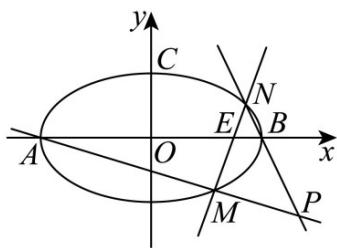

> [!faq]- 《第三章_圆锥曲线的方程_高效培优讲义_》官方解析
>
> > [!success]- **【答案】** (1) $\frac{x^2}{4} + y^2 = 1$ (2)(i)证明见解析；(ii) $\frac{\pi}{6}$
>
> > [!note]- **【解析】**
> > （1）由题意知， $\overline{CA}=\left(-a,-b\right)$ ， $\overline{CB}=\left(a,-b\right)$
> >
> > 所以 $\overline{CA} \cdot \overline{CB} = -a^{2} + b^{2} = -c^{2} = -3$ ，即 $c = \sqrt{3}$ .
> >
> > 又 $e = \frac{c}{a} = \frac{\sqrt{3}}{2}$ ，所以 $a = 2$ ， $b = \sqrt{a^2 - b^2} = 1.$ 所以椭圆的标准方程为 $\frac{x^2}{4} +y^2 = 1.$
> >
> > (2) (i) 由于直线 $MN$ 过点 $E(1,0)$ 且斜率不为 0，所以可设直线 $MN$ 的方程为 $x = my + 1$
> >
> > 由 $\left\{ \begin{array}{l} x = my + 1 \\ \frac{x^2}{4} + y^2 = 1 \end{array} \right.$ ，得 $\left(m^2 + 4\right)y^2 + 2my - 3 = 0$
> >
> > 设 $M\left(x_{1},y_{1}\right)$ ， $N\left(x_{2},y_{2}\right)$ ，则 $y_{1} + y_{2} = -\frac{2m}{m^{2} + 4}$ ， $y_{1}y_{2} = -\frac{3}{m^{2} + 4}$ ，所以 $my_{1}y_{2} = \frac{3}{2}\left(y_{1} + y_{2}\right)$
> >
> > 因为椭圆的左，右顶点分别为 $A(-2,0)$ ， $B(2,0)$ ，所以直线 $MA$ 的方程为 $y = \frac{y_1}{x_1 + 2}(x + 2)$
> >
> > 直线的方程为 $y = \frac{y_2}{x_2 - 2}(x - 2)$ ，所以 $\frac{x + 2}{x - 2} = \frac{y_2(x_1 + 2)}{y_1(x_2 - 2)} = \frac{y_2(my_1 + 3)}{y_1(my_2 - 1)} = \frac{\frac{3}{2}(y_1 + y_2) + 3y_2}{\frac{3}{2}(y_1 + y_2) - y_1} = \frac{3\left(\frac{1}{2}y_1 + \frac{3}{2}y_2\right)}{\frac{1}{2}y_1 + \frac{3}{2}y_2} = 3$ ，
> >
> > 解得 x = 4 ，所以点 P 在定直线 x = 4 上.
> >
> > (ii) 设直线 $MA, NB$ 的倾斜角分别为 $\alpha, \beta$ ，则 $\angle APB = |\beta - \alpha|$
> >
> > 
> >
> > 由（i）知 $\frac{\tan\beta}{\tan\alpha} = \frac{\frac{y_2}{x_2 - 2}}{\frac{y_1}{x_1 + 2}} = \frac{y_2(x_1 + 2)}{y_1(x_2 - 2)} = 3$ ，所以
> >
> > $$
> > \tan \beta = 3 \tan \alpha
> > $$
> >
> > $\tan \angle APB = |\tan (\beta -\alpha)| = \left|\frac{\tan\beta - \tan\alpha}{1 + \tan\beta\tan\alpha}\right| = \frac{2|\tan\alpha|}{1 + 3\tan^2\alpha} = \frac{2}{\frac{1}{|\tan\alpha|} + 3|\tan\alpha|}\leq \frac{2}{2\sqrt{3}} = \frac{\sqrt{3}}{3}$ 所以
> >
> > 当且仅当 $\left|\tan\alpha\right|=\frac{\sqrt{3}}{3}$ 时取等号，所以 $\angle APB$ 的最大值为 $\frac{\pi}{6}$ .
