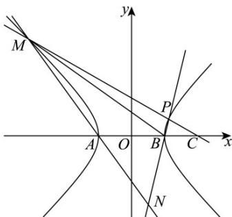

> [!faq]- 《第三章_圆锥曲线的方程_高效培优讲义_》官方解析
>
> > [!success]- **【答案】** (1) $x^{2}-y^{2}=1$ (2) (i) $x = \pm \sqrt{3} y + 2$ ; (ii) 证明见解析
>
> > [!note]- **【解析】**
> > （1）由题意： $\left\{ \begin{array}{l} \frac{c}{a} = \sqrt{2}\\ c = \sqrt{2}\\ a^2 +b^2 = c^2 \end{array} \right.$ ，解得 $\left\{ \begin{array}{ll} a = b = 1 & \text{所以双曲线的方程为：} \\ c = \sqrt{2} & \Gamma \end{array} \right.$ $x^{2} - y^{2} = 1$
> >
> > (2)
> >
> > 
> >
> > (i) 因为 $M$ 与 $A$ 不重合，所以直线 $CM$ 的斜率不为0，故可设直线 $CM$ 的方程为 $x = my + 2$
> >
> > 联立 $\left\{\begin{aligned}x&=my+2\\ x^{2}-y^{2}&=1\end{aligned}\right.$ 得 $\left(m^{2}-1\right)y^{2}+4my+3=0$ ，设 $M\left(x_{1},y_{1}\right),P\left(x_{2},y_{2}\right)$
> >
> > 因为点 $M$ 在双曲线的左支上，所以 $\left\{ \begin{array}{l} \Delta = 4m^2 + 12 > 0 \\ y_1y_2 = \frac{3}{m^2 - 1} > 0 \end{array} \right.$ ，解得 $m^2 > 1$
> >
> > 又 $\left|AB\right|=\left|OC\right|=2$ ，则 $\left|S_{1}-S_{2}\right|=\left|y_{1}-y_{2}\right|=\sqrt{6}$
> >
> > 即有 $\left(y_{1} + y_{2}\right)^{2} - 4y_{1}y_{2} = \left(\frac{-4m}{m^{2} - 1}\right)^{2} - \frac{12}{m^{2} - 1} = 6$ ，则 $3m^4 -8m^2 -3 = 0$ ，解得 $m^2 = 3$
> >
> > 满足 $m^2 > 1$ ，所以 $m = \pm \sqrt{3}$ ，于是直线 $CM$ 的方程为 $x = \pm \sqrt{3} y + 2$ 。
> >
> > (ii) 由 (i) $y_{1} + y_{2} = \frac{-4m}{m^{2} - 1}, y_{1}y_{2} = \frac{3}{m^{2} - 1}$ ，则 $\frac{y_{1} + y_{2}}{y_{1}y_{2}} = \frac{\frac{-4m}{m^{2} - 1}}{\frac{3}{m^{2} - 1}} = \frac{-4m}{3}$ ，故 $my_{1}y_{2} = -\frac{3(y_{1} + y_{2})}{4}$ .
> >
> > $A(-1,0), B(1,0)$ ，则 $k_{AM} = \frac{y_1}{x_1 + 1}$ ，所以直线 $AM$ 的方程为 $y = \frac{y_1}{x_1 + 1}(x + 1)$
> >
> > $k_{BP}=\frac{y_{2}}{x_{2}-1}$ ，所以直线BP的方程为： $y=\frac{y_{2}}{x_{2}-1}(x-1)$
> >
> > 故点 $N$ 的横坐标满足： $\frac{y_1}{x_1 + 1} (x + 1) = \frac{y_2}{x_2 - 1}(x - 1)$
> >
> > 显然 $x \neq 1$ ，由题意得： $x_{1} = my_{1} + 2, x_{2} = my_{2} + 2$
> >
> > 则 $\frac{x+1}{x-1}=\frac{y_{2}(x_{1}+1)}{y_{1}(x_{2}-1)}=\frac{y_{2}(my_{1}+3)}{y_{1}(my_{2}+1)}=\frac{my_{1}y_{2}+3y_{2}}{my_{1}y_{2}+y_{1}}=\frac{-\frac{3(y_{1}+y_{2})}{4}+3y_{2}}{-\frac{3(y_{1}+y_{2})}{4}+y_{1}}=\frac{-3(y_{1}-3y_{2})}{y_{1}-3y_{2}}=-3$
> >
> > 则 $x+1=-3(x-1)\Rightarrow x=\frac{1}{2}$ ，故点 N 在定直线 $x=\frac{1}{2}$ 上.
