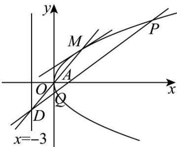
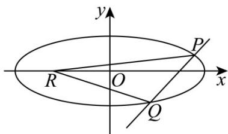

> [!faq]- 《第三章_圆锥曲线的方程_高效培优讲义_》官方解析
>
> > [!success]- **【答案】** (1) $\left(\frac{3}{4},0\right)$ (2)证明见解析
>
> > [!note]- **【解析】**
> > （1）当x=2p时， $y=\pm2p$ ，
> >
> > 不妨取 $P(2p, 2p), Q(2p, -2p)$
> >
> > 则 $\left|OP\right|=\left|OQ\right|=2\sqrt{2}p,\quad\left|PQ\right|=4p$
> >
> > 由 $\triangle POQ$ 的周长为 $6(1+\sqrt{2})$ 得，
> >
> > $4\sqrt{2}p+4p=6(1+\sqrt{2})$ ，解得 $p=\frac{3}{2}$ ，
> >
> > 故抛物线 C 的焦点坐标为 $\left(\frac{3}{4},0\right)$
> >
> > (2) 由 (1) 可知，抛物线 $C: y^{2} = 3x$
> >
> > 设直线 $PQ$ 的方程为 $x = ty + 3(t \neq 0)$
> >
> > 则直线 $PQ$ 与直线 $x = -3$ 交于点 $D\left(-3, -\frac{6}{t}\right)$
> >
> > 所以 $OD$ 的方程为 $y = \frac{2}{t} x$
> >
> > 联立 $\left\{ \begin{array}{l} y = \frac{2}{t} x \\ y^2 = 3x \end{array} \right.$ ，解得 $x_{M} = \frac{3}{4} t^{2}$ ，则 $y_{M} = \frac{3}{2} t$ ，
> >
> > 所以 $M\left(\frac{3}{4} t^2, \frac{3}{2} t\right)$
> >
> > 易知过点 $M$ 与抛物线 $C$ 相切的直线的斜率存在，设其方程为 $y - \frac{3}{2} t = k\left(x - \frac{3}{4} t^2\right)$
> >
> > 代入 $y^{2}=3x$ 得，整理得 $k^{2}x^{2}-\left(\frac{3}{2}k^{2}t^{2}-3kt+3\right)x+\frac{9}{16}k^{2}t^{4}-\frac{9}{4}kt^{3}+\frac{9}{4}t^{2}=0$
> >
> > 则 $\Delta = \left(\frac{3}{2} k^2 t^2 - 3kt + 3\right)^2 - 4k^2\left(\frac{9}{16} k^2 t^4 - \frac{9}{4} kt^3 + \frac{9}{4} t^2\right) = 0$
> >
> > 整理得 $k^{2}t^{2}-2kt+1=0$ ，
> >
> > 则 $(kt-1)^{2}=0$ ，所以 $k=\frac{1}{t}$ ，
> >
> > 故过点 $M$ 与抛物线 $C$ 相切的直线的斜率为 $\frac{1}{t}$ ，又 $PQ$ 的斜率为 $\frac{1}{t}$
> >
> > 故过点 M 与抛物线 C 的相切的直线平行于直线 PQ.
> >
> > 
> >
> > 题型14 圆锥曲线中的探索性问题
> >
> > 【典例1】已知抛物线 $C:y^{2} = 2px$ ，斜率为 $\frac{2}{3}$ 的直线 $l$ 交抛物线于 $M$ ， $N$ 两点，且 $M(1, - 2)$
> >
> > (1)求抛物线 $C$ 的方程；
> >
> > (2)若动点 $P$ 在抛物线 $C$ 上， $F$ 为抛物线的焦点，线段 $PF$ 的中点为 $Q$ ，求点 $Q$ 的轨迹方程；
> >
> > (3)试探究:抛物线 C 上是否存在点 P 使得 $PM \perp PN$ ? 若存在，求出 P 点坐标；若不存在，请说明理由.
> >
> > 【答案】(1) $y^{2}=4x$
> >
> > (2) $y^{2}=2x-1$
> >
> > (3)存在， $P(0,0),(9,-6)$
> >
> > 【详解】（1）已知点 $M(1,-2)$ 在抛物线 $y^{2}=2px$ 上
> >
> > 代入得 $(-2)^{2}=2p\cdot1\Rightarrow4=2p\Rightarrow p=2.$
> >
> > 所以抛物线方程为 $y^{2}=4x$
> >
> > (2) 易知抛物线焦点为 $F(1,0)$
> >
> > 设动点 $P(x_{0},y_{0})$ ，中点的坐标为 $Q(x,y)$
> >
> > 显然 $y_{0}^{2}=4x_{0}$ ;
> >
> > $$
> > x = \frac {x _ {0} + 1}{2} \Rightarrow x _ {0} = 2 x - 1 \quad y = \frac {y _ {0} + 0}{2} \Rightarrow y _ {0} = 2 y
> > $$
> >
> > $\therefore (2y)^{2} = 4(2x - 1) \Rightarrow y^{2} = 2x - 1$
> >
> > 即点 Q 的轨迹方程为 $y^{2}=2x-1$ ；
> >
> > (3) 设点 $P(x_{0}, y_{0})$ 在抛物线上，则 $y_{0}^{2} = 4x_{0}$
> >
> > 直线 $l$ 的方程为 $y = \frac{2}{3} (x - 1) - 2$ ，如下图：
> >
> > 
> >
> > 联立 $\left\{\begin{aligned}y&=\frac{2}{3}(x-1)-2\\ y^{2}&=4x\end{aligned}\right.$ ，解得 $\left\{\begin{aligned}x_{1}&=1\\ y_{1}&=-2\end{aligned}\right.$ ， $\left\{\begin{aligned}x_{2}&=16\\ y_{2}&=8\end{aligned}\right.$ ；
> >
> > 所以 $N(16,8)$
> >
> > 因此 $\overline{PM} = (1 - x_{0}, -2 - y_{0}), \overline{PN} = (16 - x_{0}, 8 - y_{0})$
> >
> > 依题意可得 $PM \cdot PN = 0 \Rightarrow (1 - x_{0})(16 - x_{0}) + (-2 - y_{0})(8 - y_{0}) = 0.$
> >
> > 可得 $\left(\frac{y_0^2}{4}\right)^2 - 13 \times \frac{y_0^2}{4} - 6y_0 = 0$
> >
> > 整理可得 $y_{0}^{4}-52y_{0}^{2}-96y_{0}=0$ ，即 $y_{0}(y_{0}+2)(y_{0}-8)(y_{0}+6)=0$
> >
> > 解得 $y_{0}=0$ 或 $y_{0}=-2$ 或 $y_{0}=-6$ 或 $y_{0}=8$ ；
> >
> > 显然当 $y_{0} = -2$ 或 $y_{0} = 8$ 时，与 M, N 重合，不合题意；
> >
> > 所以存在 $P(0,0),(9,-6)$ ，满足题意.
> >
> > 【典例2】已知椭圆 $C: \frac{x^2}{a^2} + \frac{y^2}{b^2} = 1 (a > b > 0)$ 的离心率为 $\frac{3\sqrt{10}}{10}$ ，焦点与短轴端点围成的四边形的面积为6.
> >
> > (1)求椭圆 C 的标准方程.
> >
> > (2)已知动直线 $l$ 过椭圆 $C$ 的右焦点 $F$ ，且与椭圆 $C$ 分别交于 $P$ ， $Q$ 两点．试问 $x$ 轴上是否存在定点 $R$ ，使得
> >
> > $RP \cdot RQ$ 为定值？若存在，求出该定值和点 $R$ 的坐标；若不存在，说明理由。
> >
> > 【答案】(1) $\frac{x^{2}}{10}+y^{2}=1$
> >
> > (2)存在； $R\left(\frac{63}{20},0\right)$ ，定值为 $-\frac{31}{400}$
> >
> > 【详解】（1）由题意得 $\frac{c}{a}=\frac{3\sqrt{10}}{10}$ ，bc=3，
> >
> > 又 $a^2 = b^2 + c^2$ ，解得 $a = \sqrt{10}$ ， $b = 1$
> >
> > 所以椭圆 $C$ 的标准方程为 $\frac{x^2}{10} + y^2 = 1$
> >
> > (2) 存在，理由如下：
> > - **①**：当直线 l 的斜率存在时，设直线 l 的方程为 $y = t(x - 3)$ ，联立椭圆 C 的方程，
> >
> > 可得 $\left(10t^2 + 1\right)x^2 - 60t^2x + 90t^2 - 10 = 0$ 设 $P(x_1, y_1)$ , $Q(x_2, y_2)$ ,
> >
> > 则 $x_{1} + x_{2} = \frac{60t^{2}}{10t^{2} + 1}$ ， $x_{1}x_{2} = \frac{90t^{2} - 10}{10t^{2} + 1}$
> >
> > $$
> > R (m, 0) \text {, 则} R P \cdot R Q = (x _ {1} - m, y _ {1}) \cdot (x _ {2} - m, y _ {2}) = (x _ {1} - m) (x _ {2} - m) + y _ {1} y _ {2}
> > $$
> >
> > $$
> > = \left(x _ {1} - m\right) \left(x _ {2} - m\right) + t ^ {2} \left[ x _ {1} x _ {2} - 3 \left(x _ {1} + x _ {2}\right) + 9 \right]
> > $$
> >
> > $$
> > = (t ^ {2} + 1) \cdot \frac {9 0 t ^ {2} - 1 0}{1 0 t ^ {2} + 1} - \frac {6 0 t ^ {2} (3 t ^ {2} + m)}{1 0 t ^ {2} + 1} + 9 t ^ {2} + m ^ {2} = \frac {(1 0 m ^ {2} - 6 0 m + 8 9) t ^ {2} + m ^ {2} - 1 0}{1 0 t ^ {2} + 1}.
> > $$
> >
> > 若 $\frac{(10m^2 - 60m + 89)t^2 + m^2 - 10}{10t^2 + 1}$ 为定值，则 $\frac{m^2 - 10}{10m^2 - 60m + 89} = \frac{1}{10}$ ，解得 $m = \frac{63}{20}$ ，
> >
> > 此时 $\frac{(10m^2 - 60m + 89)t^2 + m^2 - 10}{10t^2 + 1} = -\frac{31}{400}$ ，点 $R$ 的坐标为 $\left(\frac{63}{20}, 0\right)$
> > - **②**：当直线 l 的斜率不存在时，则直线 l 的方程为 x = 3，
> >
> > 代入 $\frac{x^2}{10} + y^2 = 1$ ，得 $\left\{ \begin{array}{l} x = 3, \\ y = \pm \frac{\sqrt{10}}{10}. \end{array} \right.$
> >
> > 不妨令 $P\left(3, \frac{\sqrt{10}}{10}\right)$ , $Q\left(3, -\frac{\sqrt{10}}{10}\right)$
> >
> > 若 $R\left(\frac{63}{20},0\right)$ ，则 $\overrightarrow{RP} = \left(-\frac{3}{20},\frac{\sqrt{10}}{10}\right)$ ， $\overrightarrow{RQ} = \left(-\frac{3}{20}, - \frac{\sqrt{10}}{10}\right)$ ， $RP\cdot RQ = -\frac{31}{400}$
> >
> > 综上所述，在 $x$ 轴上存在点 $R\left(\frac{63}{20},0\right)$ ，使得 $\overline{RP} \cdot \overline{RQ}$ 为定值，且定值为 $-\frac{31}{400}$
> >
> > 
