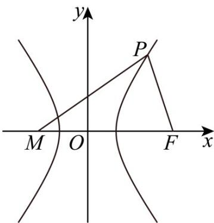

> [!faq]- 《第三章_圆锥曲线的方程_高效培优讲义_》官方解析
>
> > [!success]- **【答案】** (1) $l:3x-y-4=0$ ; (2)存在，t = -1.
>
> > [!note]- **【解析】**
> > （1）设 $A(x_{1},y_{1}),B(x_{2},y_{2})$ ，则 $\left\{ \begin{array}{l}x_1^2 -\frac{y_1^2}{3} = 1\\ x_2^2 -\frac{y_2^2}{3} = 1 \end{array} \right.$ ，作差得 $(x_{1} + x_{2})(x_{1} - x_{2}) - \frac{(y_{1} + y_{2})(y_{1} - y_{2})}{3} = 0$
> >
> > 又线段 $AB$ 的中点坐标为 $(2,2)$ ，则 $x_{1} + x_{2} = y_{1} + y_{2} = 4$
> >
> > 所以 $4(x_{1} - x_{2}) - \frac{4(y_{1} - y_{2})}{3} = 0$ ，可得 $k_{l} = \frac{y_{1} - y_{2}}{x_{1} - x_{2}} = 3$
> >
> > 所以 $l: y - 2 = 3(x - 2)$ ，即 l: 3x - y - 4 = 0；经检验成立
> >
> > (2) 假设存在定点 $M(t,0)(t<0)$ ，使得 $\angle PFM = 2\angle PMF$
> >
> > 设 $P(x_0, y_0)$ ，焦点 $F(2, 0)$ ，若 $x_0 \neq 2$ 时， $\tan \mathsf{D}PFM = \tan 2\mathsf{D}PMF = \frac{2\tan\mathsf{D}PMF}{1 - \tan^2\mathsf{D}PMF}$ ，所以 $-\frac{y_0}{x_0 - 2} = \frac{2 \cdot \frac{y_0}{x_0 - t}}{1 - (\frac{y_0}{x_0 - t})^2}$ ，化简得 $(x_0 - t)^2 - y_0^2 = 2(2 - x_0)(x_0 - t)$ ，
> >
> > 又 $x_0^2 -\frac{y_0^2}{3} = 1$ ，则 $(x_0 - t)^2 -3(x_0^2 -1) = 2(2 - x_0)(x_0 - t)$ ，整理得 $-4tx_{0} - 4x_{0} + t^{2} + 4t + 3 = 0$ 对 $x_0$ 1恒成立，所以 $\left\{ \begin{array}{l} - 4t - 4 = 0\\ t^2 +4t + 3 = 0 \end{array} \right.$ ，可得 $t = -1$ ，
> >
> > 当 $x_0 = 2 \Rightarrow y_0 = 3$ ，此时 $\triangle PMF$ 为等腰直角三角形，也成立，
> >
> > 
> >
> > 综上，t = -1.
