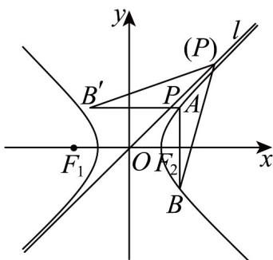
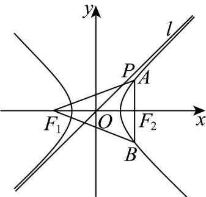

> [!faq]- 《第三章_圆锥曲线的方程_高效培优单元测试_强化卷_》官方解析
>
> > [!success]- **【答案】** ACD
>
> > [!note]- **【解析】**
> > 对于 A，因为 $\left|AB\right|=2$ ，E 的左、右两支的顶点距离也为 2，故若 A 在 E 的左支上，
> >
> > 则 A, B 均为 E 的顶点，故 $\Lambda$ 正确；
> >
> > 对于 B，若 $AF_{2} = \lambda F_{2}B$ ，则 $F_{2}, A, B$ 三点共线，考虑 A 中的情况依然符合题意，
> >
> > 此时从左到右三点顺序分别为 A, B, $F_{2}$ ，有 $\lambda < 0$ ，故 B 错误；
> >
> > 对于 $C$ ， $P$ 是 $l$ 上一点，若 $AB \perp x$ 轴，注意到当 $F_{2}, A, B$ 三点共线时 $|AB|$ 恰为 $2$
> >
> > 不妨设 A 在第一象限，则 $A(\sqrt{2},1)$ , $B(\sqrt{2},-1)$ , l:x-y=0
> >
> > 取 B 关于 l 的对称点 $B'(-1,\sqrt{2})$ ， $\left|AB'\right|=\sqrt{\left(\sqrt{2}+1\right)^{2}+\left(1-\sqrt{2}\right)^{2}}=\sqrt{6}$ ，
> >
> > 则当 $B'$ 、P、A 三点共线时 $\left|PA\right| + \left|PB'\right|$ 最小，
> >
> > 即 $\left|PA\right|+\left|PB\right|=\left|PA\right|+\left|PB'\right|\quad\left|AB'\right|=\sqrt{6}$ ，故 C 正确；
> >
> > 
> >
> > 对于 D， $\left|F_{1}A\right|+\left|F_{1}B\right|=\left|F_{2}A\right|+2+\left|F_{2}B\right|+2$ $\left|AB\right|+4=6$ ，故 D 正确。
> >
> > 
> >
> > 故选 **ACD**
