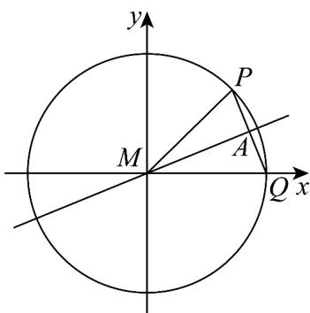
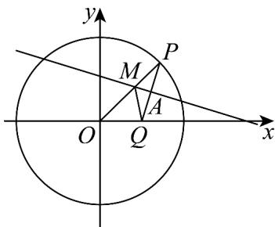
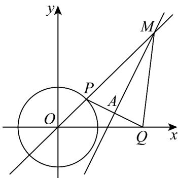

> [!faq]- 《第三章_圆锥曲线的方程_高效培优单元测试_强化卷_》官方解析
>
> > [!success]- **【答案】** BCD
>
> > [!note]- **【解析】**
> > A：如下图，当 $m = 2$ ，则 $Q$ 为圆 $O$ 与 $x$ 正半轴的交点，则 $PQ$ 是圆的一条弦，
> >
> > 所以 M 必与原点重合，即 $\Gamma$ 是一个点，不是抛物线，错；
> >
> > 
> >
> > B：如下图，当 $0 < m < 2$ ，则 $M$ 在线段 $OP$ 上，故 $|OM| + |QM| = |OM| + |MP| = |OP| = 2 > m > 0$
> >
> > 所以 M 的轨迹是以 O, Q 为焦点，长轴长为 $^{2}$ 的椭圆，
> >
> > 即 $a = 1, c = \frac{m}{2}$ ，故离心率为 $\frac{m}{2}$ ，对；
> >
> > 
> >
> > C：如下图，当 $m > 2$ ，则 $M$ 在线段 $OP$ 两侧的延长线上，且 $\|OM| - |MQ| = \|OM| - |MP| = |OP| = 2 < m$
> >
> > 所以 M 的轨迹是以 O, Q 为焦点，实轴长为 $^{2}$ 的双曲线，
> >
> > 即 $a = 1, c = \frac{m}{2}$ ，故离心率为 $\frac{m}{2}$ ，对；
> >
> > 
> >
> > D：由上分析，m=2 时 $\Gamma$ 是定点（原点），不满足；
> >
> > $0 < m < 2$ 时， $\Gamma$ 是以 $O, Q$ 为焦点，长轴长为 $2$ 的椭圆，且 $a + c = 1 + \frac{m}{2} < 2$ ，显然不可能与圆 $O$ 有公共点，
> >
> > 不满足；
> >
> > $m > 2$ 时， $\Gamma$ 是以 $O, Q$ 为焦点，实轴长为 $^2$ 的双曲线，
> >
> > 若 $2 < m \leq 6$ 时， $c - a = \frac{m}{2} - 1 \in (0, 2]$ ，即双曲线左支与圆 $O$ 有公共点，
> >
> > 若 $m > 6$ 时， $c - a = \frac{m}{2} - 1 \in (2, +\infty)$ ，即双曲线不可能与圆 $O$ 有公共点，
> >
> > 所以 $2 < m \leq 6$ ，对·
> >
> > 故选 **BCD**
