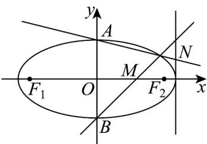

> [!faq]- 《第三章_圆锥曲线的方程_高效培优单元测试_强化卷_》官方解析
>
> > [!success]- **【答案】** (1) $\frac{x^{2}}{4}+y^{2}=1$ (2) $\left(2,\frac{1}{2}\right)$
>
> > [!note]- **【解析】**
> > （1）由题意可得 $\left\{ \begin{array}{l} \frac{c}{a} = \frac{\sqrt{3}}{2} \\ \frac{1}{2} \cdot 2c \cdot b = \sqrt{3} \\ a^2 = b^2 + c^2 \end{array} \right.$ ，解得 $\left\{ \begin{array}{l} a = 2 \\ b = 1 \\ c = \sqrt{3} \end{array} \right.$ ，所以椭圆的方程为 $\frac{x^2}{4} + y^2 = 1$
> >
> > (2) 由题意可作图如下：
> >
> > 
> >
> > 由（1）可得 $A(0,1)$ ， $B(0,-1)$ ，则由 $M(1,0)$ 得直线 $BM$ 的方程为 $y = x - 1$
> >
> > 联立 $\left\{\begin{aligned}y&=x-1\\ \frac{x^{2}}{4}&+y^{2}=1\end{aligned}\right.$ ，化简可得 $5x^{2}-8x=0$ ，解得 $x_{1}=0$ ， $x_{2}=\frac{8}{5}$ ，
> >
> > 将 $x=\frac{8}{5}$ 代入 y=x-1 ，可得 $y=\frac{3}{5}$ ，由题意可得 $\left(\frac{8}{5},\frac{3}{5}\right)$ 在直线 AN 上，
> >
> > 直线 $\underset{AN}{\text{的斜率}} k = \frac{1 - \frac{3}{5}}{0 - \frac{8}{5}} = -\frac{1}{4}$ ，则直线 $\underset{AN}{\text{的方程为}} y = -\frac{1}{4} x + 1$ ，
> >
> > 将 x=2 代入 $y=-\frac{1}{4}x+1$ ，可得 $y=\frac{1}{2}$ ，则 $N\left(2,\frac{1}{2}\right)$ .
