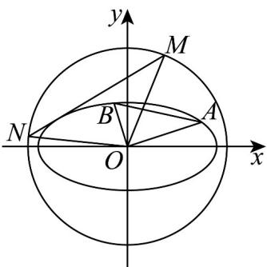

> [!faq]- 《第三章_圆锥曲线的方程_高效培优单元测试_强化卷_》官方解析
>
> > [!success]- **【答案】** (1) $\frac{x^2}{4} + y^2 = 1$ (2) $\left[\frac{4}{5},1\right]$ ; (3)证明见解析·
>
> > [!note]- **【解析】**
> > （1）依题意， $\left\{\begin{aligned}a^{2}-b^{2}&=3\\ \frac{3}{a^{2}}+\frac{1}{4b^{2}}&=1\end{aligned}\right.$ ，解得 $a^{2}=4,b^{2}=1$ ，
> >
> > 所以 C 的标准方程是 $\frac{x^{2}}{4} + y^{2} = 1$
> >
> > (2) 当点 A 不是椭圆 C 的顶点时，由 $OA \perp OB$ ，得点 B 不是椭圆 C 的顶点，
> >
> > 设直线 $OA$ 方程为 $y = kx, k \neq 0$ ，点 $A(x_A, y_B)$ ，则直线 $OB$ 方程为 $y = -\frac{1}{k} x$
> >
> > 由 $\left\{ \begin{array}{l} y = kx \\ x^2 + 4y^2 = 4 \text{得} \end{array} \right|$ $x_A| = \frac{2}{\sqrt{1 + 4k^2}}$ ， $OA| = \sqrt{1 + k^2}$ $x_A| = \frac{2\sqrt{1 + k^2}}{\sqrt{1 + 4k^2}}$ ，同理 $OB| = \frac{2\sqrt{1 + k^2}}{\sqrt{4 + k^2}}$
> >
> > $S_{\triangle ABC}=\frac{1}{2}|OA||OB|=\frac{2(1+k^{2})}{\sqrt{4k^{4}+17k^{2}+4}}=\frac{2}{\sqrt{-9(\frac{1}{1+k^{2}}-\frac{1}{2})^{2}+\frac{25}{4}}}$
> >
> > 而 $0 < \frac{1}{1 + k^2} < 1$ ，因此 $\frac{4}{5} \leq S_{\triangle ABC} < 1$ ，当且仅当 $k^2 = 1$ 时取等号，
> >
> > 点 A 是椭圆 C 的顶点时，点 B 也是椭圆 C 的顶点， $S_{\triangle ABC} = \frac{1}{2} ab = 1$ ，
> >
> > 所以 $\triangle OAB$ 面积的取值范围是 $[\frac{4}{5}, 1]$ .
> >
> > 
> >
> > (3) 依题意，蒙日圆 $\Gamma$ 的方程为： $x^{2} + y^{2} = 5$
> >
> > 当直线 $MN$ 斜率不存在时，直线 $MN$ 的方程为： $x = 2$ 或 $x = -2$
> >
> > 直线 MN 与 $\Gamma$ 的交点为 $(2, \pm1)$ 或 $(-2, \pm1)$ ，则 $k_{OM} \cdot k_{ON} = \frac{1}{2} \cdot \left( -\frac{1}{2} \right) = -\frac{1}{4}$ ;
> >
> > 当直线 $MN$ 斜率存在时，设直线 $MN$ 的方程为： $y = mx + t$
> >
> > 由 $\left\{ \begin{array}{l} y = mx + t \\ x^2 + 4y^2 = 4 \text{消去} y \text{并整理得:} (4m^2 + 1)x^2 + 8mtx + 4t^2 - 4 = 0 \end{array} \right.$
> >
> > 则 $\Delta = 64m^2 t^2 - 16(4m^2 + 1)(t^2 - 1) = 0$ ，即 $t^2 = 4m^2 + 1$ ，设 $M(x_1, y_1), N(x_2, y_2), x_1x_2 \neq 0$
> >
> > 由 $\left\{\begin{aligned}y&=mx+t\\ x^{2}&+y^{2}=5\end{aligned}\right.$ 消去 y 并整理得： $(m^{2}+1)x^{2}+2mtx+t^{2}-5=0$
> >
> > $$
> > \Delta_ {1} = 4 m ^ {2} t ^ {2} - 4 \left(m ^ {2} + 1\right) \left(t ^ {2} - 5\right) = 4 \left(5 m ^ {2} - t ^ {2} + 5\right) = 4 \left(m ^ {2} + 4\right) > 0, x _ {1} + x _ {2} = \frac {- 2 m t}{m ^ {2} + 1}, x _ {1} x _ {2} = \frac {t ^ {2} - 5}{m ^ {2} + 1}
> > $$
> >
> > $$
> > k _ {O M} \cdot k _ {O N} = \frac {y _ {1} y _ {2}}{x _ {1} x _ {2}} = \frac {(m x _ {1} + t) (m x _ {2} + t)}{x _ {1} x _ {2}} = \frac {m ^ {2} x _ {1} x _ {2} + m t (x _ {1} + x _ {2}) + t ^ {2}}{x _ {1} x _ {2}}
> > $$
> >
> > $$
> > = \frac {m ^ {2} \cdot \frac {t ^ {2} - 5}{m ^ {2} + 1} + m t \cdot \frac {- 2 m t}{m ^ {2} + 1} + t ^ {2}}{\frac {t ^ {2} - 5}{m ^ {2} + 1}} = \frac {t ^ {2} - 5 m ^ {2}}{t ^ {2} - 5} = \frac {4 m ^ {2} + 1 - 5 m ^ {2}}{4 m ^ {2} + 1 - 5} = - \frac {1}{4},
> > $$
> >
> > 所以 $k_{OM} \cdot k_{ON}$ 为定值 $-\frac{1}{4}$ .
