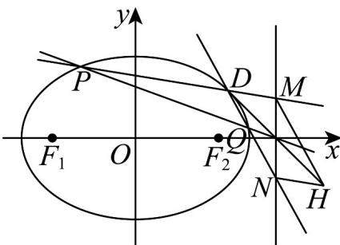

> [!faq]- 《第三章_圆锥曲线的方程_高效培优单元测试_强化卷_》官方解析
>
> > [!success]- **【答案】** (1) $\frac{x^{2}}{6}+\frac{y^{2}}{3}=1$ ; (2) ① $m = \pm \sqrt{2}$ ; ② 存在, $H(4, -1)$ .
>
> > [!note]- **【解析】**
> > （1）因为离心率为 $\frac{\sqrt{2}}{2}$ ，所以 $\frac{c}{a} = \frac{\sqrt{2}}{2}$ ，由椭圆的定义知 $\left|AF_1\right| + \left|AF_2\right| = 2a$
> >
> > 由基本不等式得 $\left|AF_{1}\right|\cdot\left|AF_{2}\right|\leq\frac{\left(\left|AF_{1}\right|+\left|AF_{2}\right|\right)^{2}}{4}=a^{2}=6$ ，当且仅当 $\left|AF_{1}\right|=\left|AF_{2}\right|=a$ 时等号成立，
> >
> > 故 $a=\sqrt{6}$ ，所以 $c=\sqrt{3}$ ，所以 $b^{2}=a^{2}-c^{2}=3$ ，故椭圆C的方程为 $\frac{x^{2}}{6}+\frac{y^{2}}{3}=1$
> >
> > (2) ①设 $P(x_{1}, y_{1})$ ， $Q(x_{2}, y_{2})$
> >
> > 由 $\left\{\begin{aligned}x&=my+3\\ \frac{x^{2}}{6}&+\frac{y^{2}}{3}=1\end{aligned}\right.$ ，得 $(m^{2}+2)y^{2}+6my+3=0$ ，
> >
> > 由 $\Delta = 36m^2 - 12(m^2 + 2) > 0$ ，得 $m^2 > 1$ ， $y_1 + y_2 = \frac{-6m}{m^2 + 2}$ ， $y_1y_2 = \frac{3}{m^2 + 2}$
> >
> > 设 PQ 中点坐标为 $\left(\frac{3}{2}, y_{0}\right)$ ，则 $y_{0} = \frac{y_{1} + y_{2}}{2} = -\frac{3m}{m^{2} + 2}$ ，
> >
> > 因为 $\left(\frac{3}{2},y_{0}\right)$ 在直线PQ上，所以 $\frac{3}{2}=my_{0}+3$ ，即 $y_{0}=-\frac{3}{2m}$
> >
> > 所以 $-\frac{3m}{m^2 + 2} = -\frac{3}{2m}$ ，解得 $m = \pm \sqrt{2}$
> >
> > 
> > - **②**：存在点 $H(x_{H}, y_{H})$ 使得四边形 DMHN 为平行四边形，
> >
> > 因为 $D(2,1)$ 在椭圆上，所以易知 $x_{1} \neq 2$ ， $x_{2} \neq 2$ ，
> >
> > 设直线 DM 的方程为 $y-1=\frac{y_{1}-1}{x_{1}-2}(x-2)$
> >
> > 令 x=3 ，得 $y_{M}=\frac{y_{1}-1}{x_{1}-2}+1=\frac{y_{1}-1}{my_{1}+1}+1=\frac{(m+1)y_{1}}{my_{1}+1}$ ，同理 $y_{N}=\frac{(m+1)y_{2}}{my_{2}+1}$
> >
> > 又由①知 $y_{1}y_{2}=-\frac{1}{2m}(y_{1}+y_{2})$
> >
> > $$
> > y _ {M} + y _ {N} = \frac {(m + 1) y _ {1}}{m y _ {1} + 1} + \frac {(m + 1) y _ {2}}{m y _ {2} + 1} = \frac {2 (m + 1) m y _ {1} y _ {2} + (m + 1) (y _ {1} + y _ {2})}{(m y _ {1} + 1) (m y _ {2} + 1)}
> > $$
> >
> > $$
> > = \frac {2 (m + 1) m \left(- \frac {1}{2 m}\right) \left(y _ {1} + y _ {2}\right) + (m + 1) \left(y _ {1} + y _ {2}\right)}{\left(m y _ {1} + 1\right) \left(m y _ {2} + 1\right)} = 0
> > $$
> >
> > 所以线段 $MN$ 的中点坐标为 $(3,0)$
> >
> > 连接 $DH$ ，则线段 $DH$ 的中点坐标也为 $(3,0)$
> >
> > 由于 $D(2,1)$ ，可得 $\left\{ \begin{array}{l} \frac{x_H + 2}{2} = 3 \\ \frac{y_H + 1}{2} = 0 \end{array} \right.$ ，所以点 $H$ 的坐标为 $H(4, - 1)$
