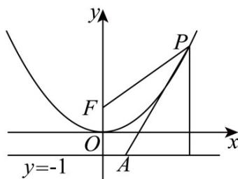

> [!faq]- 《第三章_圆锥曲线的方程_高效培优单元测试_提升卷_》官方解析
>
> > [!success]- **【答案】** B
>
> > [!note]- **【解析】**
> > 由抛物线的定义将 $\left|PF\right|$ 长度转化为点P到准线的距离，
> >
> > 
> >
> > 如图可知，当直线 PA 与抛物线相切且斜率为负值时，满足题意，
> >
> > 令 $PA:y + 1 = k(x - 1)$ ，联立 $x^{2} = 4y$ ，则 $x^{2} - 4kx + 4k + 4 = 0$
> >
> > 所以 $\Delta = 16k^{2} - 16(k + 1) = 0$ ，可得 $k^{2} - k - 1 = 0$ ，则 $k = \frac{1 - \sqrt{5}}{2}$ （正值舍）.
> >
> > 故选 **B**
