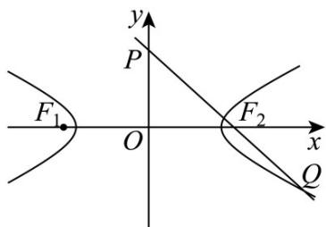

> [!faq]- 《第三章_圆锥曲线的方程_高效培优单元测试_提升卷_》官方解析
>
> > [!success]- **【答案】** B
>
> > [!note]- **【解析】**
> > 依题意，设直线 PQ 方程为 $y = kx + m$ ，则 $P(0, m)$ .
> >
> > 因为 $F_{2}(c,0)$ ， $PF_{2}=F_{2}Q$ ，
> >
> > 所以 $F_{2}$ 为 PQ 的中点，那么 $Q(2c,-m)$ .
> >
> > 所以 $F_{2}Q=(c,-m),PF_{2}=(c,-m)$ .
> >
> > 又 $\left|F_{1}F_{2}\right|=\left|F_{2}Q\right|=2c$ ，所以 $\sqrt{c^{2}+m^{2}}=2c$ ，解得 $m^{2}=3c^{2}$ ①.
> >
> > 将点 $Q(2c,-m)$ 代入双曲线方程得： $\frac{4c^{2}}{a^{2}}-\frac{m^{2}}{b^{2}}=1$ ②.
> >
> > 将①代入②得 $4c^{4} - 7c^{2}a^{2} = a^{2}\left(c^{2} - a^{2}\right)$ ，方程两边同时除以 $a^4$
> >
> > 得到 $4e^{4} - 8e^{2} + 1 = 0$ ，解得 $e = \frac{\sqrt{3}\pm 1}{2}$
> >
> > 又 $e=\frac{c}{a}>1$ ，所以 $e=\frac{\sqrt{3}+1}{2}$
> >
> > 故选：B.
> >
> > 
