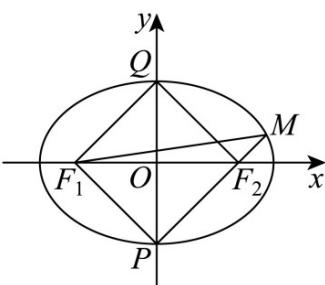

> [!faq]- 《第三章_圆锥曲线的方程_高效培优单元测试_提升卷_》官方解析
>
> > [!success]- **【答案】** B
>
> > [!note]- **【解析】**
> > 设椭圆 $E$ 的左焦点为 $F_{1}$ ，连接 $PF_{1}, QF_{1}$
> >
> > 
> >
> > 不妨设 $\left|MF_{2}\right|=1$ ，则 $\left|QF_{2}\right|=3\left|MF_{2}\right|=3$ 因为 $\left|OP\right|=\left|OQ\right|,\left|OF_{1}\right|=\left|OF_{2}\right|$ ，且 $QF_{2} \perp MF_{2}$ ，可知 $QF_{1}PF_{2}$ 为矩形，
> > 则 $\left|PF_{1}\right|=\left|QF_{2}\right|=3,\left|PF_{2}\right|=\left|QF_{1}\right|$ 又因为 $\left|QF_{1}\right|+\left|QF_{2}\right|=2a,\left|MF_{1}\right|+\left|MF_{2}\right|=2a$ 即 $\left|PF_{2}\right|+3=2a,\left|MF_{1}\right|+1=2a$ 可得 $\left|PF_{2}\right|=2a-3,\left|MF_{1}\right|=2a-1$ ，则 $\left|PM\right|=2a-2$ 在 Rt△PMF₁ 中， $\left|PF_{1}\right|^{2}+\left|PM\right|^{2}=\left|MF_{1}\right|^{2}$ 即 $9+(2a-2)^{2}=(2a-1)^{2}$ ，解得 a=3，
> >
> > 可得 $\left|PF_2\right| = 3$ ，则 $\left|F_1F_2\right| = \sqrt{\left|PF_1\right|^2 + \left|PF_2\right|^2} = 3\sqrt{2}$
> >
> > 即 $2c = 3\sqrt{2}$ ，可得 $c = \frac{3\sqrt{2}}{2}$
> >
> > 所以椭圆 E 的离心率为 $e=\frac{c}{a}=\frac{\sqrt{2}}{2}$
> >
> > 故选 **B**.
