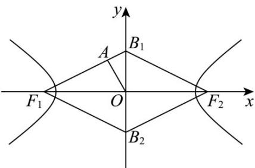

> [!faq]- 《第三章_圆锥曲线的方程_高效培优单元测试_提升卷_》官方解析
>
> > [!success]- **【答案】** $\frac{2\sqrt{3}}{3} / \frac{2}{3}\sqrt{3}$
>
> > [!note]- **【解析】**
> > 由题意， $F_{1}(-c,0),F_{2}(c,0)$ ，因为四边形面积为 $^{4}$ ，
> >
> > $S = 2 \times \frac{1}{2} \times 2b \times c = 2bc = 4$ 所以 bc = 2 ①.
> >
> > 因为 $F_{1}B_{1}=F_{2}B_{1}=F_{2}B_{2}=F_{1}B_{2}=\sqrt{b^{2}+c^{2}}$ ，所以四边形 $F_{1}B_{1}F_{2}B_{2}$ 为菱形.
> >
> > 通过三角形面积相等 $S_{\triangle OF_1B_1} = \frac{1}{2} bc = \frac{1}{2}\sqrt{b^2 + c^2}\cdot r$
> >
> > 所以 $r=\frac{bc}{\sqrt{b^{2}+c^{2}}}=\frac{2\sqrt{5}}{5}$ ，因为 bc=2，所以 $b^{2}+c^{2}=5$ ②.
> > - **①**：②联立解得 c=2 或者 c=1 ，因为 c>b ，所以 c=2,b=1 .
> >
> > 所以双曲线的离心率为 $e=\frac{c}{a}=\sqrt{\frac{c^{2}}{c^{2}-b^{2}}}=\sqrt{\frac{4}{4-1}}=\frac{2\sqrt{3}}{3}$
> >
> > 故答案为： $\frac{2\sqrt{3}}{3}$
> >
> > 
