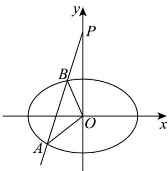

> [!faq]- 《第三章_圆锥曲线的方程_高效培优单元测试_提升卷_》官方解析
>
> > [!success]- **【答案】** $\left(\frac{c}{a}, -\frac{bp}{a}\right)$
>
> > [!note]- **【解析】**
> > 任取直线 $l: ax + by + c = 0$ 上的一点 $Q(x_{0}, y_{0})$ ,
> >
> > 当 $b \neq 0$ 时，则有 $ax_0 + by_0 + c = 0$ ，即 $y_0 = -\frac{a}{b} x_0 - \frac{c}{b}$ ①，
> >
> > 过点 Q 作抛物线 $y^{2}=2px$ 的两条切线，切点分别为 A，B，
> >
> > 则弦 $AB$ 所在的直线方程为 $y_{0}y = p(x_{0} + x)$
> >
> > 把①式代入可得： $\left(-\frac{a}{b} x_0 - \frac{c}{b}\right)y = p(x_0 + x)$ ，即 $\left(-\frac{a}{b} y - p\right)x_0 = px + \frac{c}{b} y$
> >
> > 令 $-\frac{a}{b} y - p = 0$ 且 $px + \frac{c}{b} y = 0$ ，可得：弦 $AB$ 所在的直线过定点
> >
> > 当 $b = 0$ 时，则有 $a \neq 0$ ， $x_0 = -\frac{c}{a}$
> >
> > 过点 Q 作抛物线 $y^{2}=2px$ 的两条切线，切点分别为 A，B，
> >
> > 则弦 AB 所在的直线方程为 $y_{0}y = p\left(-\frac{c}{a} + x\right)$ ，将 $\left(\frac{c}{a}, -\frac{bp}{a}\right)$ ，即 $\left(\frac{c}{a}, 0\right)$ 代入成立，
> >
> > 所以弦 $AB$ 所在的直线过定点 $\left(\frac{c}{a}, -\frac{bp}{a}\right)$
> >
> > 故答案为： $\left(\frac{c}{a},-\frac{bp}{a}\right)$
> >
> > 四、解答题：本题共5小题，共77分。解答应写出文字说明、证明过程或演算步骤。
> >
> > 15. 椭圆 $\frac{x^2}{a^2} + \frac{y^2}{b^2} = 1$ ( $a > b > 0$ ) 的左右焦点分别为 $F_1, F_2$ ，其中 $F_2(1,0)$ ， $O$ 为原点。椭圆上任意一点到
> >
> > $F_{1}$ ， $F_{2}$ 距离之和为 $2\sqrt{2}$
> >
> > (1)求椭圆的标准方程及离心率；
> >
> > (2)过点 $P(0,3)$ 的直线 $l$ 交椭圆于A、 $B$ 两点， $\triangle OAB$ 面积为 $\overline{19}$ ，求 $l$ 的方程。
> >
> > $$
> > \frac {6 \sqrt {5}}{1 9}
> > $$
> >
> > 【答案】(1) $\frac{x^{2}}{2}+y^{2}=1,\quad\frac{\sqrt{2}}{2}$
> >
> > (2) $y=3x+3$ 或 $y=-3x+3$
> >
> > 【详解】（1）由题意得 $c = 1$ ， $2a = 2\sqrt{2}$ ，解得 $a = \sqrt{2}$
> >
> > 故 $b^{2}=a^{2}-c^{2}=1$
> >
> > 故椭圆的标准方程为 $\frac{x^2}{2} + y^2 = 1$
> >
> > 离心率为 $\frac{c}{a} = \frac{1}{\sqrt{2}} = \frac{\sqrt{2}}{2}$ ;
> >
> > (2) 由题意，直线斜率不存在时，不能构成 $\triangle OAB$
> >
> > 故设直线 $l$ 方程为 $y = kx + 3$
> >
> > 
> >
> > 联立 $\frac{x^2}{2} + y^2 = 1$ 得， $(1 + 2k^2)x^2 + 12kx + 16 = 0$
> >
> > 设 $A(x_{1},y_{1}),B(x_{2},y_{2})$
> >
> > $\Delta=12^{2}k^{2}-4\times16\left(1+2k^{2}\right)>0$ ，解得 k>2 或 k<-2，
> >
> > 则 $x_{1} + x_{2} = -\frac{12k}{1 + 2k^{2}}, x_{1} \cdot x_{2} = \frac{16}{1 + 2k^{2}}$
> >
> > 所以 $\left|AB\right|=\sqrt{1+k^{2}}\sqrt{\left(x_{1}+x_{2}\right)^{2}-4x_{1}x_{2}}=\sqrt{1+k^{2}}\sqrt{\left(-\frac{12k}{1+2k^{2}}\right)^{2}-4\times\frac{16}{1+2k^{2}}}$
> >
> > $$
> > = \frac {4 \sqrt {1 + k ^ {2}} \cdot \sqrt {k ^ {2} - 4}}{1 + 2 k ^ {2}}
> > $$
> >
> > 设 $O$ 到直线 $l$ 的距离为 $d$ ，则 $d = \frac{|0 - 0 + 3|}{\sqrt{1 + k^2}} = \frac{3}{\sqrt{1 + k^2}}$
> >
> > 所以 $S_{\triangle OAB} = \frac{1}{2} |AB| \cdot d = \frac{2\sqrt{1 + k^{2}} \cdot \sqrt{k^{2} - 4}}{1 + 2k^{2}} \cdot \frac{3}{\sqrt{1 + k^{2}}} = \frac{6\sqrt{k^{2} - 4}}{1 + 2k^{2}} = \frac{6\sqrt{5}}{19}$
> >
> > 解得 $k = \pm3$ ，
> >
> > 所以直线 l 的方程为 $y = 3x + 3$ 或 $y = -3x + 3$ .
