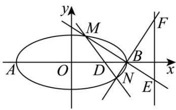

> [!faq]- 《第三章_圆锥曲线的方程_高效培优单元测试_提升卷_》官方解析
>
> > [!success]- **【答案】** (1) $\frac{x^2}{4} + y^2 = 1$ (2) (i) $2x + 8y - 5 = 0$ ；(ii) 存在， $D\left(\frac{6}{5}, 0\right)$ 或 $D\left(3 - \sqrt{5}, 0\right)$
>
> > [!note]- **【解析】**
> > （1）由题可知 $\left\{ \begin{array}{l} |AB| = 2a = 4 \\ \frac{c}{a} = \frac{\sqrt{3}}{2} \\ b = \sqrt{a^2 - c^2} \end{array} \right.$ ，解得 $\left\{ \begin{array}{l} a = 2 \\ b = 1 \\ c = \sqrt{3} \end{array} \right.$ ，
> >
> > 所以椭圆 C 的方程为 $\frac{x^{2}}{4} + y^{2} = 1$ .
> >
> > (2) (i) 设 $M(x_{1}, y_{1})$ 、 $N(x_{2}, y_{2})$ ， $x_{1} \neq x_{2}$ ，
> >
> > 若MN的中点为 $\left(\frac{1}{2},\frac{1}{2}\right)$ ，则 $x_{1}+x_{2}=1$ ， $y_{1}+y_{2}=1$ 。
> >
> > 又 $\left\{ \begin{array}{l} \frac{x_1^2}{4} + y_1^2 = 1 \\ \frac{x_2^2}{4} + y_2^2 = 1 \end{array} \right.$ ，两式相减可得 $\frac{x_1^2 - x_2^2}{4} + y_1^2 - y_2^2 = 0$
> >
> > 即 $\frac{(x_1 - x_2)(x_1 + x_2)}{4} + (y_1 - y_2)(y_1 + y_2) = 0$
> >
> > 所以 $\frac{x_{1}-x_{2}}{4}+y_{1}-y_{2}=0$ ，所以 $\frac{y_{1}-y_{2}}{x_{1}-x_{2}}=-\frac{1}{4}$ ，故 l 的斜率为 $-\frac{1}{4}$
> >
> > 因为点 $\left(\frac{1}{2},\frac{1}{2}\right)$ 在 $l$ 上，所以 $l$ 的方程为 $y - \frac{1}{2} = -\frac{1}{4}\left(x - \frac{1}{2}\right)$ ，即 $2x + 8y - 5 = 0$ ；
> >
> > (ii) 设 $D(t,0)(-2 < t < 2)$ ，由题可知直线 $l$ 的斜率不为 0，可设直线 $l: x = my + t$
> >
> > 由 $\left\{\begin{aligned}x&=my+t\\\frac{x^{2}}{4}&+y^{2}=1\end{aligned}\right.$ 得 $(my+t)^{2}+4y^{2}-4=0$
> >
> > 
> >
> > 即 $\left(m^{2} + 4\right)y^{2} + 2mty + t^{2} - 4 = 0$
> >
> > 则 $\Delta = 4m^{2}t^{2} - 4(m^{2} + 4)(t^{2} - 4) > 0$ ，得 $t^{2} < m^{2} + 4$ ，
> >
> > 由韦达定理可得 $y_{1} + y_{2} = -\frac{2mt}{m^{2} + 4}$ ， $y_{1}y_{2} = \frac{t^{2} - 4}{m^{2} + 4}$
> >
> > 直线 BM 的方程为 $y = \frac{y_{1}}{x_{1} - 2}(x - 2)$ ， $x_{1} \neq \pm 2$ ，
> >
> > 令 $x = 3$ 可得 $y = \frac{y_1}{x_1 - 2}$ ，即点 $E\left(3,\frac{y_1}{x_1 - 2}\right)$
> >
> > 同理可得点 $F\left(3,\frac{y_{2}}{x_{2}-2}\right)$ ， $x_{2}\neq\pm2$ ，
> >
> > 则 $\overrightarrow{ME}=\left(3-x_{1},\frac{y_{1}\left(3-x_{1}\right)}{x_{1}-2}\right)$ ， $\overrightarrow{NF}=\left(3-x_{2},\frac{y_{2}\left(3-x_{2}\right)}{x_{2}-2}\right)$
> >
> > 所以 $\overline{ME} \cdot \overline{NF} = (3 - x_{1})(3 - x_{2}) + \frac{y_{1}y_{2}(3 - x_{1})(3 - x_{2})}{(x_{1} - 2)(x_{2} - 2)}$
> >
> > $$
> > = \left(x _ {1} - 3\right) \left(x _ {2} - 3\right) \left[ 1 + \frac {y _ {1} y _ {2}}{\left(x _ {1} - 2\right) \left(x _ {2} - 2\right)} \right]
> > $$
> >
> > $$
> > = \left(m y _ {1} + t - 3\right) \left(m y _ {2} + t - 3\right) \left[ 1 + \frac {y _ {1} y _ {2}}{\left(m y _ {1} + t - 2\right) \left(m y _ {2} + t - 2\right)} \right]
> > $$
> >
> > $$
> > = \left[ m ^ {2} y _ {1} y _ {2} + (t - 3) m \left(y _ {1} + y _ {2}\right) + (t - 3) ^ {2} \right] \left[ 1 + \frac {y _ {1} y _ {2}}{m ^ {2} y _ {1} y _ {2} + (t - 2) m \left(y _ {1} + y _ {2}\right) + (t - 2) ^ {2}} \right]
> > $$
> >
> > $$
> > = \frac {1}{4} \cdot \frac {5 m ^ {2} + 4 t ^ {2} - 2 4 t + 3 6}{m ^ {2} + 4} \cdot \frac {5 t - 6}{t - 2}
> > $$
> >
> > $$
> > = \frac {1}{4} \left(5 + \frac {4 t ^ {2} - 2 4 t + 1 6}{m ^ {2} + 4}\right) \cdot \frac {5 t - 6}{t - 2} = \left(\frac {5}{4} + \frac {t ^ {2} - 6 t + 4}{m ^ {2} + 4}\right) \cdot \frac {5 t - 6}{t - 2},
> > $$
> >
> > 当 $5t - 6 = 0$ ，即 $t = \frac{6}{5}$ 时， $\overline{ME} \cdot \overline{NF} = 0$
> >
> > 当 $t^2 - 6t + 4 = 0$ ，即 $t = 3 - \sqrt{5}$ （ $t = 3 + \sqrt{5}$ 舍去）时， $\vec{ME} \cdot \vec{NF} = 5 - \frac{5\sqrt{5}}{4}$
> >
> > 故当 $D\left(\frac{6}{5},0\right)$ 或 $D\left(3-\sqrt{5},0\right)$ 时， $ME \cdot NF$ 为定值.
