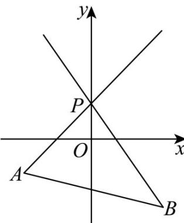

> [!faq]- 《专题01_直线的倾斜角_斜率及方程的四大常考题型_高效培优专项训练_》官方解析
>
> > [!success]- **【答案】** B
>
> > [!note]- **【解析】**
> > 已知 $A(-2, - 1)$ ， $P(0,1)$ ，根据过两点直线斜率公式，可得：
> >
> > $k_{PA}=\frac{1-(-1)}{0-(-2)}=\frac{2}{2}=1$ 已知 $B(2,-2)$ ， $P(0,1)$ ，同理可得： $k_{PB}=\frac{1-(-2)}{0-2}=\frac{3}{-2}=-\frac{3}{2}$ 当直线 l 绕点 P 从 PB 位置旋转到与 y 轴重合时，斜率的范围是 $(-∞,-\frac{3}{2}]$ ；
> > 当直线 l 绕点 P 从与 y 轴重合旋转到 PA 位置时，斜率的范围是 $[1,+\infty)$ .
> > 所以直线 l 斜率的取值范围是 $(-∞,-\frac{3}{2}]\cup[1,+∞)$ .
> >
> > 故选：B.
> >
> > 
