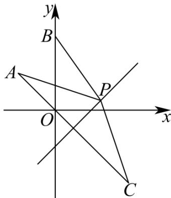

> [!faq]- 《专题01_直线的倾斜角_斜率及方程的四大常考题型_高效培优专项训练_》官方解析
>
> > [!success]- **【答案】** (1) $4x - 3y - 6 = 0$ (2) $2\sqrt{5}$
>
> > [!note]- **【解析】**
> > （1）联立方程 $\left\{ \begin{array}{l}x - y - 1 = 0\\ x + y - 5 = 0 \end{array} \right.$ ，解得 $x = 3,y = 2$
> >
> > 因为所求直线垂直于直线 $3x + 4y - 5 = 0$ ，所以所求直线的斜率为 $\frac{4}{3}$
> >
> > 故所求直线方程为 $y - 2 = \frac{4}{3} (x - 3)$ ，即 $4x - 3y - 6 = 0$ ；
> >
> > (2) 设点 $A(-1,1)$ 关于直线 $l_{1}$ 对称的点为 $C(m,n)$
> >
> > 则 $\left\{ \begin{array}{l} \frac{m - 1}{2} - \frac{n + 1}{2} - 1 = 0 \\ \frac{n - 1}{m + 1} = -1 \end{array} \right.$ ，解得 $m = 2, n = -2$ ，即 $C(2, -2)$ ；
> >
> > 则 $\left|PA\right|+\left|PB\right|=\left|PB\right|+\left|PC\right|\quad\left|BC\right|=2\sqrt{5}$
> >
> > 故 $|PA|+|PB|$ 的最小值为 $2\sqrt{5}$
> >
> > 
