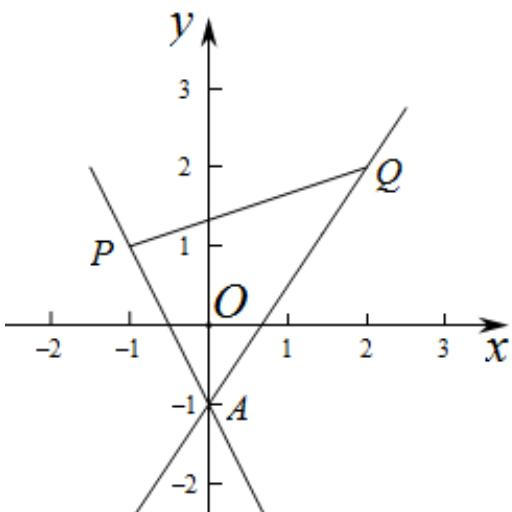

> [!faq]- 《专题01_直线的倾斜角_斜率及方程的四大常考题型_高效培优专项训练_》官方解析
>
> > [!success]- **【答案】** $(-∞,-2]∪\left[\frac{3}{2},+∞\right)$
>
> > [!note]- **【解析】**
> > 因为直线 l 恒过 $A(0,-1)$ , $P(-1,1)$ 和 $Q(2,2)$ ,
> >
> > 所以 $k_{AP}=\frac{-1-1}{0+1}=-2$ ， $k_{AQ}=\frac{-1-2}{0-2}=\frac{3}{2}$ .
> >
> > 由题意可知，直线 l 的斜率存在且 l 的斜率 k，若直线 l 与线段 PQ 有交点，如图所示由图象可知， $k \quad k_{AQ}$ 或 $k \leq k_{AP}$ ，即 $\frac{3}{2}$ 或 $k \leq -2$ ，
> > 所以 l 的斜率 k 的取值范围是为 $(-∞, -2] ∪ \left[\frac{3}{2}, +∞\right)$ .
> > 故答案为： $(-∞,-2]∪\left[\frac{3}{2},+∞\right)$ .
> >
> > 
