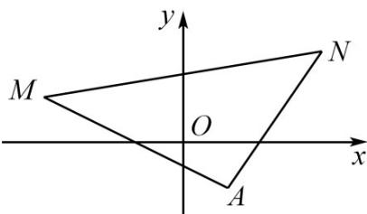

> [!faq]- 《专题01_直线的倾斜角_斜率及方程的四大常考题型_高效培优专项训练_》官方解析
>
> > [!success]- **【答案】** C
>
> > [!note]- **【解析】**
> > 
> >
> > 直线 $kx - y - k - 1 = 0$ 恒过定点 $A(1, - 1)$ ，且 $k_{MA} = -\frac{1}{2}$ ， $k_{NA} = \frac{3}{2}$ ，由图可知， $k\leq -\frac{1}{2}$ 或 $k = \frac{3}{2}$
> >
> > 故选 **C**.
