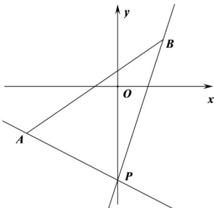

> [!faq]- 《专题01_直线的倾斜角_斜率及方程的四大常考题型_高效培优专项训练_》官方解析
>
> > [!success]- **【答案】** D
>
> > [!note]- **【解析】**
> > 如图所示，
> >
> > 
> >
> > 因为 $A(-2, - 1),B(1,1),P(0, - 2)$
> >
> > 所以 $k_{PA}=\frac{-1-(-2)}{-2-0}=-\frac{1}{2}$ ， $k_{PB}=\frac{1-(-2)}{1-0}=3$ ，
> >
> > 又因为直线 $l$ 过点 $P(0, -2)$ 且与线段 $AB$ 相交，
> >
> > 所以直线 $l$ 的斜率取值范围为 $k = 3$ 或者 $k \leq -\frac{1}{2}$
> >
> > 即 $k \in \left(-\infty, -\frac{1}{2}\right] \cup [3, +\infty)$ .
> >
> > 故选 **D**.
