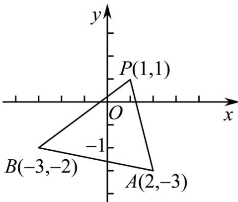

> [!faq]- 《专题01_直线的倾斜角_斜率及方程的四大常考题型_高效培优专项训练_》官方解析
>
> > [!success]- **【答案】** A
>
> > [!note]- **【解析】**
> > 解： $\because k = \frac{y_1 - y_2}{x_1 - x_2}$ ， $\therefore$ 可得 $\frac{y - 1}{x - 1}$ 为点 $(x, y)$ 与 $P(1, 1)$ 与直线的斜率取值范围，
> >
> > 如图所示：
> >
> > 
> >
> > $\therefore(1,1)$ 与 $_{B}$ 点连线斜率为 $k_{1}=\frac{1-(-2)}{1-(-3)}=\frac{3}{4}$
> >
> > (1,1)与 $\mathrm{A}$ 点连线斜率为 $k_{2} = \frac{1 - (-3)}{1 - 2} = -4$
> >
> > ∴可得斜率取值范围为 $(-∞,-4]∪\left[\frac{3}{4},+∞\right)$
> >
> > 故选 **A**
