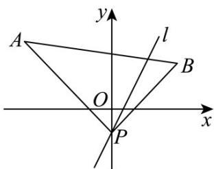

> [!faq]- 《专题01_直线的倾斜角_斜率及方程的四大常考题型_高效培优专项训练_》官方解析
>
> > [!success]- **【答案】** (1) $(-∞,-1]∪[1,+∞)$ 或斜率不存在 $$ \left[ \frac {\pi}{4}, \frac {3 \pi}{4} \right] $$
>
> > [!note]- **【解析】**
> > （1）如图，由题意可知
> >
> > $$
> > k _ {P A} = \frac {3 - (- 1)}{- 4 - 0} = - 1
> > $$
> >
> > $$
> > k _ {P B} = \frac {2 - (- 1)}{3 - 0} = 1
> > $$
> >
> > 
> >
> > 要使直线 l 与线段 AB 有公共点，
> >
> > 则直线 l 的斜率 k 的取值范围是 $(-∞, -1] ∪ [1, +∞)$ 或斜率不存在.
> >
> > (2) 由题意可知， $l$ 的倾斜角介于直线 $PB$ 与 $PA$ 的倾斜角之间。
> >
> > 又 $PB$ 的倾斜角是 $\frac{\pi}{4}$ ， $PA$ 的倾斜角是 $\frac{3\pi}{4}$
> >
> > 所以直线 l 的倾斜角 $\alpha$ 的取值范围是 $\left[\frac{\pi}{4}, \frac{3\pi}{4}\right]$ .
