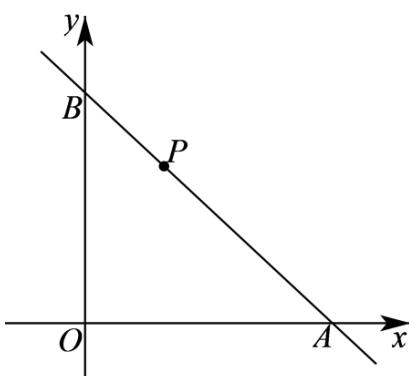

> [!faq]- 《专题01_直线的倾斜角_斜率及方程的四大常考题型_高效培优专项训练_》官方解析
>
> > [!success]- **【答案】** C
>
> > [!note]- **【解析】**
> > 不妨设直线 l 分别交 x 、 y 轴于点 $A(a,0)$ 、 $B(0,b)$ ，则 a > 0，b > 0
> >
> > 
> >
> > 所以，直线 $l$ 的截距式方程为 $\frac{x}{a} +\frac{y}{b} = 1$ ，因为点 $P$ 在直线 $l$ 上，则 $\frac{1}{a} +\frac{2}{b} = 1$
> >
> > 由基本不等式可得 $1 = \frac{1}{a} +\frac{2}{b}$ $2\sqrt{\frac{2}{ab}} = \frac{2\sqrt{2}}{\sqrt{ab}}$ ，可得 $ab\quad 8$ ，则 $S_{\triangle AOB} = \frac{1}{2} ab\quad 4$
> >
> > 当且仅当 $\left\{ \begin{array}{l} \frac{1}{a} = \frac{2}{b} \\ \frac{1}{a} + \frac{2}{b} = 1 \end{array} \right.$ 时，即当 $\left\{ \begin{array}{l} a = 2 \text{时，等号成立，} \\ b = 4 \end{array} \right.$
> >
> > 故VAOB的面积的最小值为4·
> >
> > 故选 **C**.
