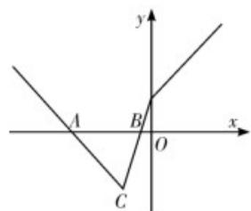

> [!faq]- 《专题01_直线的倾斜角_斜率及方程的四大常考题型_高效培优专项训练_》官方解析
>
> > [!success]- **【答案】** （Ⅰ） $(-∞,-3]∪[1,+∞)$ （Ⅱ）a 6
>
> > [!note]- **【解析】**
> > （1）时， $f(x)=\left|2x+1\right|-\left|x\right|=\begin{cases}x+1,x&0,\\3x+1,-\frac{1}{2}<x<0,\\-x-1,x\leq-\frac{1}{2}.\end{cases}$
> >
> > $\left\{ \begin{array}{ll}x & 0,\\ x + 1 & 2 \end{array} \right.$ 得 $x = 1$ 无解 $\left\{ \begin{array}{ll} - \frac{1}{2} <  x <   0,\\ 3x + 1 & 2 \end{array} \right.$ 得 $x\leq -3$
> >
> > 综上，得不等式的解集为 $\left(-\infty, -3\right] \cup \left[1, +\infty\right)$ .
> >
> > (Ⅱ) 因为，则 $f(x)=\left\{\begin{aligned}x+a,x&=0,\\ 3x+a,-\frac{a}{2}<x<0,\\ -x-a,x&\leq-\frac{a}{2}.\end{aligned}\right.$ a>0
> >
> > 其图象与 $x$ 轴围成的三角形 $\Delta ABC$ ，其坐标分别为 $A(-a,0)$ ， $B\left(-\frac{a}{3},0\right)$ ， $C\left(-\frac{a}{2},-\frac{a}{2}\right)$ .
> >
> > 则 $S_{\triangle ABC} = \frac{1}{2}\cdot \left| - \frac{a}{2} -(-a)\right|\cdot \left| - \frac{a}{2}\right| = \frac{a^2}{6}$ 6，因为 $a > 0$ ，得 $a = 6$
> >
> > 
