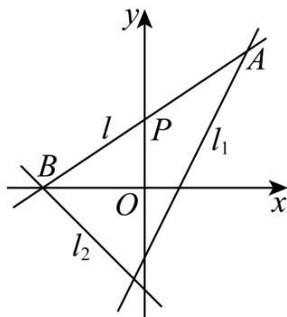

> [!faq]- 《专题02_直线的交点坐标与距离公式_的四大常考题型_高效培优专项训练_》官方解析
>
> > [!success]- **【答案】** A
>
> > [!note]- **【解析】**
> > 因为直线 $l_{1}: x + 2y + 1 = 0$ 与直线 $l_{2}: 4x + ay - 2 = 0$ 垂直，
> >
> > 所以 $1 \times 4 + 2a = 0$ ，解得 $a = -2$
> >
> > 直线 $l_{2}$ 的方程为 4x - 2y - 2 = 0.
> >
> > 由 $\left\{\begin{aligned}x+2y+1=0\\ 4x-2y-2=0\end{aligned}\right.$ ，解得 $\left\{\begin{aligned}x=\frac{1}{5}\\ y=-\frac{3}{5}\end{aligned}\right.$ ，故交点坐标为 $\left(\frac{1}{5},-\frac{3}{5}\right)$ .
> >
> > 故选：A.
> >
> > 5. 过直线 $x + y + 1 = 0$ 和 $x - 2y + 7 = 0$ 的交点，且与直线 $x + 2y - 3 = 0$ 垂直的直线方程是（）.
> > A $2x - y + 3 = 0$ B $2x - y + 5 = 0$ C $x + 2y - 4 = 0$ D $2x - y + 8 = 0$
> >
> > 【答案】D
> >
> > 【详解】联立方程 $\left\{ \begin{array}{l}x + y + 1 = 0\\ x - 2y + 7 = 0 \end{array} \right.$ ，解得 $\left\{ \begin{array}{ll}x = -3\\ y = 2 \end{array} \right.$ ，所以交点坐标为 $(-3,2)$
> >
> > 直线 $x + 2y - 3 = 0$ 的斜率为 $-\frac{1}{2}$ ，所以所求直线方程的斜率为 $-\frac{1}{-\frac{1}{2}} = 2$
> >
> > 由点斜式直线方程得：所求直线方程为 $y - 2 = 2(x + 3)$ ，即 $2x - y + 8 = 0$ ；
> >
> > 故选：D
> >
> > 6．过点 $P(0,2)$ 作直线 $l$ ，使它被两条相交直线 $2x - y - 2 = 0$ 和 $x + y + 3 = 0$ 所截得的线段，恰好被点 $P$ 平分，则直线 $l$ 的方程为 \_\_\_\_。
> >
> > 【答案】 $2x - 3y + 6 = 0$
> >
> > 【详解】设直线 $l_{1}:2x-y-2=0,\quad l_{2}:x+y+3=0$
> >
> > 设直线 l 夹在直线 $l_{1}$ ， $l_{2}$ 之间的线段为 AB（A 在 $l_{1}$ 上，B 在 $l_{2}$ 上），
> >
> > 设 $A(x_{1},y_{1})$ 、 $B(x_{2},y_{2})$
> >
> > 因为 AB 被点 $P(0,2)$ 平分，所以 $x_{1} + x_{2} = 0$ ， $y_{1} + y_{2} = 4$
> >
> > 于是 $x_{2} = -x_{1}$ ， $y_{2} = 4 - y_{1}$
> >
> > 由于 $\mathrm{A}$ 在 $l_{1}$ 上， $_B$ 在 $l_{2}$ 上，则 $\left\{ \begin{array}{l}2x_{1} - y_{1} - 2 = 0\\ x_{2} + y_{2} + 3 = 0 \end{array} \right.$
> >
> > 即 $\left\{\begin{aligned}&2x_{1}-y_{1}-2=0\\&-x_{1}+4-y_{1}+3=0\end{aligned}\right.$ 解得 $x_{1}=3,\quad y_{1}=4$
> >
> > 即 $_{\mathrm{A}}$ 的坐标是 $(3,4)$ ，则直线 $l$ 的方程是 $\frac{y - 2}{4 - 2} = \frac{x}{3}$
> >
> > 即 $2x - 3y + 6 = 0$
> >
> > 故答案为： $2x - 3y + 6 = 0$ .
> >
> > 
