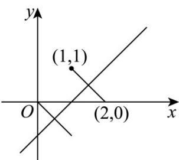

> [!faq]- 《专题02_直线的交点坐标与距离公式_的四大常考题型_高效培优专项训练_》官方解析
>
> > [!success]- **【答案】** C
>
> > [!note]- **【解析】**
> > $\sqrt{(x_0 + 1)^2 + (y_0 - 1)^2}$ 表示点 $(x_0, y_0)$ 到点 $(-1, 1)$ 的距离，
> >
> > 故 $\sqrt{(x_0 + 1)^2 + (y_0 - 1)^2}$ 的最小值为点 $(-1, 1)$ 到直线 $x + 2y + 6 = 0$ 的距离 $d = \frac{|-1 + 2 + 6|}{\sqrt{1^2 + 2^2}} = \frac{7\sqrt{5}}{5}$
> >
> > 故选：C
> >
> > 26. 将一张坐标纸折叠一次，使点 $(2,0)$ 与点 $(1,1)$ 重合，此时点 $(m,n)$ 与原点 $(0,0)$ 重合，则 $m \cdot n$ 的值是
> >
> > 【答案】-1
> >
> > 【详解】如图：可知折痕为点 $(2,0)$ 与点 $(1,1)$ 的中垂线，
> >
> > 
> >
> > 中点坐标为 $\left(\frac{3}{2},\frac{1}{2}\right)$ ，
> >
> > 设折痕直线的斜率为 $k$ ，则 $k \times \frac{1 - 0}{1 - 2} = -1$ ，得 $k = 1$ ，
> >
> > 故折痕直线方程为 $y - \frac{1}{2} = x - \frac{3}{2}$ ，即 $x - y - 1 = 0$ ，
> >
> > 由题意点 $(m,n)$ 与原点 $(0,0)$ 关于折痕对称，故 $\left\{ \begin{array}{l} \frac{m}{2} - \frac{n}{2} - 1 = 0 \\ \frac{m}{n} \times 1 = -1 \end{array} \right.$ 得 $\left\{ \begin{array}{ll} m = 1 & , \text{故} \\ n = -1 & m \cdot n = 1 \cdot (-1) = -1 \end{array} \right.$
> >
> > 故答案为：-1
