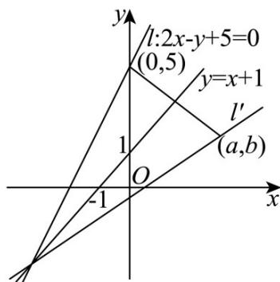

> [!faq]- 《专题02_直线的交点坐标与距离公式_的四大常考题型_高效培优专项训练_》官方解析
>
> > [!success]- **【答案】** (1)证明见解析 (2) $x - 2y - 2 = 0$ (3)4 : $x - 2y + 4 = 0$
>
> > [!note]- **【解析】**
> > （1）因为直线 $l: kx - 3y + 2k + 3 = 0 (k \in \mathbf{R})$
> >
> > 即 $(x + 2)k - 3y + 3 = 0$
> >
> > 所以直线 l 恒过定点 $(-2,1)$ .
> >
> > (2) 由题知，直线 l 方程为 $2x - y + 5 = 0$ ，
> >
> > 设直线 l 关于直线 $y = x + 1$ 对称的直线为 $l'$ ，如图，
> >
> > 联立 $\left\{ \begin{array}{l} y = x + 1 \\ 2x - y + 5 = 0 \end{array} \right.$ ，解得 $\left\{ \begin{array}{l} x = -4 \\ y = -3 \end{array} \right.$ ，
> >
> > 即直线 $l'$ 过 $(-4,-3)$
> >
> > 在直线 l 上取 $(0,5)$ ，设其关于 $y=x+1$ 的对称点为 $(a,b)$ ，
> >
> > 则 $\left\{ \begin{array}{l} \frac{b - 5}{a - 0} \times 1 = -1 \\ \frac{b + 5}{2} = \frac{a + 0}{2} + 1 \end{array} \right.$ ，解得 $\left\{ \begin{array}{l} a = 4 \\ b = 1 \end{array} \right.$
> >
> > 即直线 $l'$ 过 $(4,1)$
> >
> > 所以直线 $l'$ 方程为 $y-1=\frac{1-(-3)}{4-(-4)}(x-4)$
> >
> > 即直线 $l'$ 方程为 x-2y-2=0.
> >
> > 
> >
> > (3) 由题知， $k \neq 0$ ，
> >
> > 则 $A\left(-\frac{2k + 3}{k},0\right),B\left(0,\frac{2k + 3}{3}\right)$
> >
> > 且 $\left\{ \begin{array}{l} -\frac{2k + 3}{k} < 0 \\ \frac{2k + 3}{3} > 0 \end{array} \right.$ ，解得 $k > 0$
> >
> > 所以 $S=\frac{1}{2}\times\frac{2k+3}{k}\times\frac{2k+3}{3}=\frac{2k}{3}+\frac{3}{2k}+2$ 4，
> >
> > 当且仅当 $\frac{2k}{3} = \frac{3}{2k}$ ，即 $k = \frac{3}{2}$ 时，等号成立，
> >
> > 此时直线 $l$ 的方程为 $\frac{3}{2} x - 3y + 2 \times \frac{3}{2} + 3 = 0$
> >
> > 即 $x - 2y + 4 = 0$
> >
> > 综上，S 的最小值为 4，
> >
> > 且此时直线 l 的方程为 $x - 2y + 4 = 0$ .
