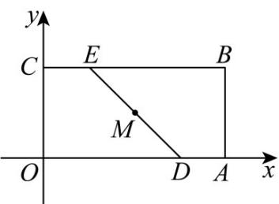

> [!faq]- 《专题02_直线的交点坐标与距离公式_的四大常考题型_高效培优专项训练_》官方解析
>
> > [!success]- **【答案】** $\sqrt{2}$
>
> > [!note]- **【解析】**
> > 
> >
> > 设 $M(x,y)$ ，因为点 $M$ 在矩形 $OABC$ 内（含边界），
> >
> > 则 $0 \leq x \leq 2$ ， $0 \leq y \leq 1$
> >
> > 因为点 $M$ 到点 $O$ ， $B$ 的“折线距离”相等，
> >
> > 所以 $|x - 0| + |y - 0| = |x - 2| + |y - 1|$ ，即 $x + y = 2 - x + 1 - y$
> >
> > 则 $x + y = \frac{3}{2}$ ，
> >
> > 当 y=0 时， $x=\frac{3}{2}$ ，
> >
> > 当 y=1 时， $x=\frac{1}{2}$ ，
> >
> > 设 $D\left(\frac{3}{2},0\right)$ ， $E\left(\frac{1}{2},1\right)$ ，则点 $M$ 的轨迹为线段 $DE$
> >
> > 故点 M 的轨迹长度为 $\left|DE\right|=\sqrt{2}$ .
> >
> > 故答案为： $\sqrt{2}$
