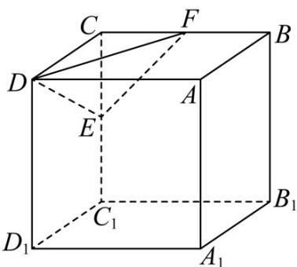

<!-- question-source:start -->
9. 已知正方体 $ABCD - A_{1}B_{1}C_{1}D_{1}$ 的体积为 8，线段 $CC_{1}, BC$ 的中点分别为 $E, F$ ，动点 $G$ 在下底面 $A_{1}B_{1}C_{1}D_{1}$ 内（含边界），且 $GE = AA_{1}$ ，则动点 $G$ 的轨迹长度为（）

A. $2\sqrt{5}\pi$ B. $\frac{\sqrt{5}\pi}{2}$ C. $2\sqrt{3}\pi$ D. $\frac{\sqrt{3}\pi}{2}$
<!-- question-source:end -->

![[高中/课堂同步/题库/人教A版高中数学同步讲义(2026)/03_选择性必修第一册/第二章 直线和圆的方程/专项训练/专题03_圆的方程的四大常考题型_高效培优专项训练_/题型一_sec_02/questions/answers/Q00063327A1.md]]
