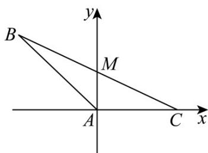

> [!faq]- 《专题03_圆的方程的四大常考题型_高效培优专项训练_》官方解析
>
> > [!success]- **【答案】** $\sqrt{21}$
>
> > [!note]- **【解析】**
> > 如图建系， $A(0,0),C(1,0),B(-1,\sqrt{3}),M\left(0,\frac{\sqrt{3}}{2}\right)$
> >
> > 
> >
> > 设VABC的外接圆的方程为 $x^{2} + y^{2} + D_{1}x + Ey + F = 0$
> >
> > $$
> > \therefore \left\{ \begin{array}{c} F = 0 \\ 1 + D _ {1} + F = 0 \\ 4 - D _ {1} + \sqrt {3} E + F = 0 \end{array} , \therefore \left\{ \begin{array}{c} D _ {1} = - 1 \\ E = - \frac {5 \sqrt {3}}{3} \\ F = 0 \end{array} , \right. \right.
> > $$
> >
> > 即 $x^{2} + y^{2} - x - \frac{5\sqrt{3}}{3} y = 0$
> >
> > $$
> > \left\{ \begin{array}{c} x = 0 \\ x ^ {2} + y ^ {2} - x - \frac {5 \sqrt {3}}{3} y = 0 \end{array} , \therefore \left\{ \begin{array}{l} x = 0 \\ y = \frac {5 \sqrt {3}}{3} \end{array} , \text {即} D \left(0, \frac {5 \sqrt {3}}{3}\right) \right. \right.
> > $$
> >
> > $$
> > D B + D C = \sqrt {1 + \frac {4}{3}} + \sqrt {1 + \frac {2 5}{3}} = \sqrt {\frac {7}{3}} + \sqrt {\frac {2 8}{3}} = \sqrt {2 1}
> > $$
> >
> > 故答案为： $\sqrt{21}$
> >
> > 15. 平面几何中有一个著名的定理：VABC 的三条高线的垂足、三边中点及三个顶点与垂心连线段的中点共圆，该圆称为 VABC 的九点圆或欧拉圆，若 $A(-2,1)$ ， $B(4,1)$ ，VABC 的垂心为 $G(3,3)$ ，则 VABC 的九点圆的标准方程为 \_\_\_\_。
> >
> > 【答案】 $(x-2)^{2}+\left(y-\frac{17}{8}\right)^{2}=\frac{145}{64}$
> >
> > 【详解】由 $A(-2,1)$ ， $B(4,1)$ ， $G(3,3)$ ，可得 AB 中点为 $D(1,1)$ ，AG 中点为 $E\left(\frac{1}{2},2\right)$ ，BG 中点为 $F\left(\frac{7}{2},2\right)$ ，
> >
> > 设VABC的九点圆方程为 $x^{2} + y^{2} + Dx + Ey + F = 0$
> >
> > 代入 三点坐标，可得 $\left\{ \begin{array}{l}1 + 1 + D + E + F = 0\\ \frac{1}{4} +4 + \frac{1}{2} D + 2E + F = 0\\ \frac{49}{4} +4 + \frac{7}{2} D + 2E + F = 0 \end{array} \right.$
> >
> > 解得 $D = -4, E = -\frac{17}{4}, F = \frac{101}{16}$
> >
> > 即 $x^{2} + y^{2} - 4x - \frac{17}{4} y + \frac{101}{16} = 0$
> >
> > 化简可得圆的标准方程为 $\left(x - 2\right)^2 +\left(y - \frac{17}{8}\right)^2 = \frac{145}{64}$
> >
> > 故答案为： $(x - 2)^{2} + \left(y - \frac{17}{8}\right)^{2} = \frac{145}{64}$
