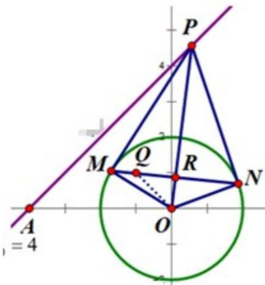

> [!faq]- 《专题03_圆的方程的四大常考题型_高效培优专项训练_》官方解析
>
> > [!success]- **【答案】** $2 \sqrt{2}$
>
> > [!note]- **【解析】**
> > 如图，由 $MR = RN$ 可知 $R$ 为 $MN$ 的中点，所以 $OR \perp MN$ ， $PR \perp MN$
> >
> > 
> >
> > 设 $P(x_0, y_0), M(x_1, y_1), N(x_2, y_2)$ ，则切线 $\mathsf{PM}$ 的方程为 $y - y_1 = -\frac{x_1}{y_1}(x - x_1)$
> >
> > 即 $PM:x_{1}x + y_{1}y = x_{1}^{2} + y_{1}^{2} = 4$ ，同理可得 $PN:x_2x + y_2y = 4$
> >
> > 因为 PM，PN 都过 $P(x_{0}, y_{0})$ ，所以 $x_{1}x_{0} + y_{1}y_{0} = 4$ ， $x_{2}x_{0} + y_{2}y_{0} = 4$ ，
> >
> > 所以 $M(x_{1},y_{1}), N(x_{2},y_{2})$ 在直线 $xx_{0} + yy_{0} = 4$ 上，
> >
> > 从而直线 MN 方程为 $xx_{0} + yy_{0} = 4$
> >
> > 因为 $x_{0}=a, y_{0}=a+4$ ，所以 $ax+(a+4)y=4\Rightarrow a(x+y)+4y-4=0$ ，
> >
> > 即直线 MN 方程为 $a(x+y)+4y-4=0$
> >
> > 所以直线 MN 过定点 $Q(-1,1)$ ,
> >
> > 所以 R 在以 OQ 为直径的圆 $T: \left(x + \frac{1}{2}\right)^{2} + \left(y - \frac{1}{2}\right)^{2} = \frac{1}{2}$ 上，
> >
> > 所以 $|AR|_{\min}=AT-r=\frac{5\sqrt{2}}{2}-\frac{\sqrt{2}}{2}=2\sqrt{2}$ .
> >
> > 故答案为： $2\sqrt{2}$
> >
> > 34. 过点 $B(1,2)$ 作互相垂直的直线 $l_1, l_2, l_1$ 交 $y$ 正半轴于 A 点， $l_2$ 交 $x$ 正半轴于 C 点，则线段 $AC$ 中点 $M$ 轨迹方程为 \_\_\_\_；过原点 $O$ 与 A、B、C 四点的圆半径的最小值为 \_\_\_\_。
> >
> > 【答案】 $4y+2x-5=0\left(x>0,y>0\right)\quad\frac{\sqrt{5}}{2}$
> >
> > 【详解】设 $l_{1}$ 的方程： $y-2=k(x-1)$ ，则 $l_{2}$ 方程为： $y-2=-\frac{1}{k}(x-1)$
> >
> > $\therefore l_{1}$ 交 y 正半轴于 A 点, 可得 $A(0,2-k)$
> >
> > $\therefore l_{2}$ 交 x 正半轴于 C 点, 可得 $C(2k+1,0)$
> >
> > ∵ M 为线段 AC 中点, 设 $M(x, y)$
> >
> > 根据中点坐标公式可得： $\left\{\begin{aligned}x&=\frac{0+(2k+1)}{2}\\ y&=\frac{(2-k)+0}{2}\end{aligned}\right.$ 即： $\left\{\begin{aligned}x&=k+\frac{1}{2}\\ y&=1-\frac{k}{2}\end{aligned}\right.$ ，消掉
> >
> > ∴ 线段 AC 中点 M 轨迹方程为： $4y + 2x - 5 = 0$
> >
> > $$
> > \because A B \perp B C, O A \perp O C
> > $$
> >
> > ∴存在经过 O 、 A 、 B 、 C 四点的圆,该圆以 AC 为直径.
> > - **①**：若 $l_{1}\perp y$ 轴， $l_{2}\perp x$ 轴， $|AC|=\sqrt{5}$
> > - **②**：若两条直线斜率均存在，设 $l_{1}$ 斜率为k $\therefore l_{1}$ 方程为 $y-2=k(x-1)$ ， $A(0,2-k)$ $l_{2}$ 方程为 $y-2=-\frac{1}{k}(x-1)$ ， $C(2k+1,0)$ 令 $\begin{cases}2-k>0\\2k+1>0\end{cases}$ ，解出 $k\in\left(-\frac{1}{2},2\right)$ $\because k\neq0$ $\therefore k\in\left(-\frac{1}{2},0\right)\cup(0,2)$ ， $|AC|^{2}=|2-k|^{2}+(2k+1)^{2}=5k^{2}+5>5$ ， $|AC|>\sqrt{5}$ $\therefore$ 半径最小值为 $\frac{\sqrt{5}}{2}$ 故答案为： $4y+2x-5=0(x>0,y>0),\frac{\sqrt{5}}{2}$ .
