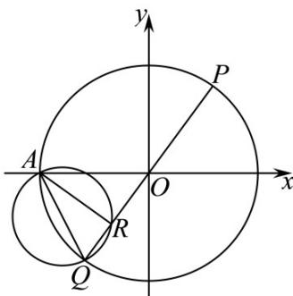

> [!faq]- 《专题04_直线与圆_圆与圆的位置关系的四大常考题型_高效培优专项训练_》官方解析
>
> > [!success]- **【答案】** $y = \pm \sqrt{3} x$
>
> > [!note]- **【解析】**
> > 设 $P(x_{1},y_{1})$ ，则 $Q(-x_1, - y_1)$ ，由 $R$ 在 $PQ$ 上，设 $R(kx_1,ky_1)(k\neq \pm 1)$
> >
> > 因为 $A(-1,0)$ ，所以圆 O 的方程为 $x^{2} + y^{2} = 1$ ，
> >
> > 因为 $Q, P$ 在圆 $O$ 上，所以 $x_{1}^{2} + y_{1}^{2} = 1$
> >
> > 因为点 $R$ 在以 $AQ$ 为直径的圆上，所以 $\overline{AR} \cdot \overline{QR} = 0$
> >
> > $\overline{AR}=(kx_{1}+1,ky_{1}),\overline{QR}=(kx_{1}+x_{1},ky_{1}+y_{1})$ ，所以 $k(k+1)x_{1}^{2}+k(k+1)y_{1}^{2}+(k+1)x_{1}=0$
> >
> > $k(k+1)\left(x_{1}^{2}+y_{1}^{2}\right)+(k+1)x_{1}=0$ ，即 $k(k+1)+(k+1)x_{1}=0$
> >
> > 因为 $k \neq -1$ ，所以可得 $x_{1} = -k$
> >
> > 又 $k_{AR} \cdot k_{AP} = 1$ ， $k_{AR} = \frac{ky_1}{kx_1 + 1}$ ， $k_{AP} = \frac{y_1}{x_1 + 1}$ ，所以 $\frac{ky_1}{kx_1 + 1} \times \frac{y_1}{x_1 + 1} = 1$
> >
> > $$
> > k x _ {1} ^ {2} + k x _ {1} + x _ {1} + 1 = k y _ {1} ^ {2} = k \left(1 - x _ {1} ^ {2}\right)
> > $$
> >
> > 化简得 $2kx_{1}^{2}+(k+1)x_{1}+1-k=0$ ，又因为 $x_{1}=-k$ ，
> >
> > 所以 $2k^{3} - k^{2} - k + 1 - k = 0$ ，解得 $k = \pm 1$ 或 $k = \frac{1}{2}$ ，因为 $k\neq \pm 1$ ，所以 $k = \frac{1}{2}$
> >
> > $x_{1} = -\frac{1}{2}$ ，代入 $x_{1}^{2} + y_{1}^{2} = 1$ 得 $y_{1} = \pm \frac{\sqrt{3}}{2}$ ，所以 $k = \pm \sqrt{3}$
> >
> > 可得直线 PQ 的方程为 $y = \pm \sqrt{3}x$ .
> >
> > 故答案为： $k=\pm\sqrt{3}$
> >
> > 
