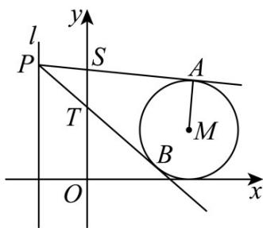

> [!faq]- 《专题04_直线与圆_圆与圆的位置关系的四大常考题型_高效培优专项训练_》官方解析
>
> > [!success]- **【答案】** (1) $\frac{3\sqrt{10}}{5}$ (2) $\frac{\sqrt{2}}{4}$
>
> > [!note]- **【解析】**
> > （1）由圆 $M:(x - 2)^{2} + (y - 1)^{2} = 1$ ，可知 $M(2,1)$ ，半径为1，
> >
> > 设过点 $P(-1,2)$ 引圆 $M$ 的切线，显然两条切线的斜率都存在，
> >
> > 设切线方程为： $y-2=k(x+1)$ ，即 $kx-y+k+2=0$ ，
> >
> > 由 $\frac{|2k - 1 + k + 2|}{\sqrt{k^2 + 1}} = 1$ ，解得 $k = 0$ 或 $k = -\frac{3}{4}$
> >
> > 因此切线所在直线方程为 $y - 2 = 0$ 或 $3x + 4y - 5 = 0$
> >
> > 分别联立 $\left\{\begin{aligned}y-2&=0\\ (x-2)^{2}+(y-1)^{2}&=1\end{aligned}\right.$ ， $\left\{\begin{aligned}3x+4y-5&=0\\ (x-2)^{2}+(y-1)^{2}&=1\end{aligned}\right.$
> >
> > 解得 $\left\{ \begin{array}{l}x = 2\\ y = 2 \end{array} \right.$ ， $\left\{ \begin{array}{ll}x = \frac{7}{5}\\ y = \frac{1}{5} \end{array} \right.$ 即 $A(2,2),B\left(\frac{7}{5},\frac{1}{5}\right)$
> >
> > 所以 $\left|AB\right|=\sqrt{\left(2-\frac{7}{5}\right)^{2}+\left(2-\frac{1}{5}\right)^{2}}=\frac{3\sqrt{10}}{5}$ .
> >
> > (2) 由 (1) 知 $M(2,1)$ ，半径为 1，
> >
> > 设过点 $P(-1, t)$ 引圆 $M$ 的切线，显然两条切线的斜率都存在，
> >
> > 设切线方程为： $y-t=k(x+1)$ ，即 $kx-y+k+t=0$ ，
> >
> > 因为 $PA \perp AM$ ，所以 $|AM| = \frac{|2k - 1 + k + t|}{\sqrt{k^2 + 1}} = 1$ ，即 $8k^2 + 6(t - 1)k + t^2 - 2t = 0$ ，
> >
> > 设 $k_{1}$ ， $k_{2}$ 是方程 $8k^{2} + 6(t - 1)k + t^{2} - 2t = 0$ 的两个根，
> >
> > 则 $k_{1} + k_{2} = \frac{3(1 - t)}{4}$ ， $k_{1}k_{2} = \frac{t^{2} - 2t}{8}$
> >
> > 所以 $\left|k_{1}-k_{2}\right|=\sqrt{\left(k_{1}+k_{2}\right)^{2}-4k_{1}k_{2}}=\sqrt{\left[\frac{3(1-t)}{4}\right]^{2}-4\times\frac{t^{2}-2t}{8}}=\frac{\sqrt{t^{2}-2t+9}}{4}$ ，
> >
> > 在切线方程中，令 $x = 0$ ，得 $y = k + t$
> >
> > 设 $S(0,k_1 + t)$ ， $T(0,k_2 + t)$
> >
> > 则 $\left|ST\right|=\left|k_{1}-k_{2}\right|=\frac{\sqrt{t^{2}-2t+9}}{4}$
> >
> > 则 $\triangle PST$ 的面积为 $S = \frac{1}{2}\left|ST\right|\times 1 = \frac{\sqrt{t^2 - 2t + 9}}{8} = \frac{\sqrt{(t - 1)^2 + 8}}{8}$
> >
> > 当 $t = 1$ 时， $\triangle PST$ 的面积取得最小值，最小值为 $\frac{\sqrt{2}}{4}$
> >
> > 
