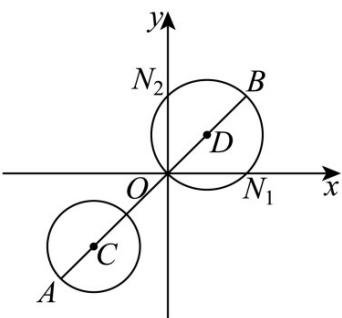
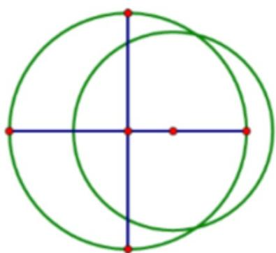
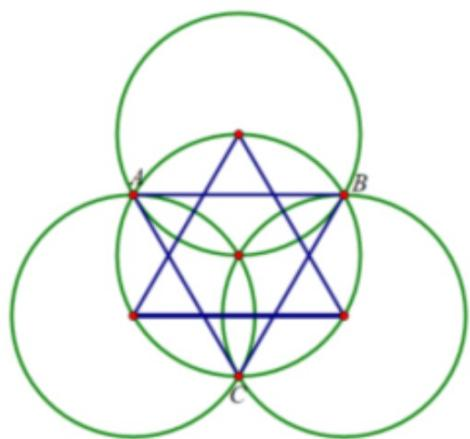
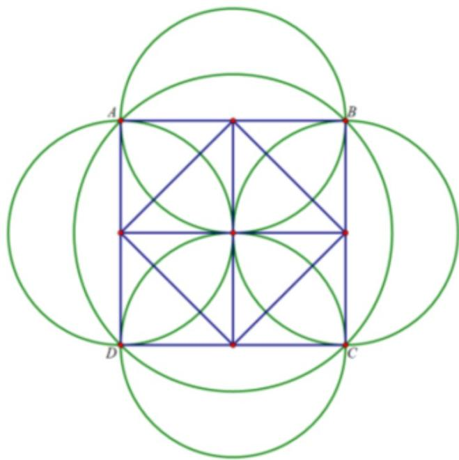

> [!faq]- 《专题04_直线与圆_圆与圆的位置关系的四大常考题型_高效培优专项训练_》官方解析
>
> > [!success]- **【答案】** C
>
> > [!note]- **【解析】**
> > 设圆 C 的方程为 $(x-a)^{2}+(y-b)^{2}=r^{2}$ .
> >
> > 因为圆 $C$ 过点 $M_{1}(-3, - 2)$ ， $M_{2}(-2, - 1)$ ， $M_{3}(-2, - 3)$ ，将这三个点代入圆的方程可得：
> >
> > $$
> > \left\{ \begin{array}{l} (- 3 - a) ^ {2} + (- 2 - b) ^ {2} = r ^ {2} \\ (- 2 - a) ^ {2} + (- 1 - b) ^ {2} = r ^ {2} \\ (- 2 - a) ^ {2} + (- 3 - b) ^ {2} = r ^ {2} \end{array} \right.
> > $$
> >
> > 由 $(-2 - a)^{2} + (-1 - b)^{2} = (-2 - a)^{2} + (-3 - b)^{2}$ 可得： $(-1 - b)^{2} = (-3 - b)^{2}$
> >
> > $1+2b+b^{2}=9+6b+b^{2}$ ，即4b=-8，解得b=-2。
> >
> > 将 $b = -2$ 代入 $(-3 - a)^{2} + (-2 - b)^{2} = (-2 - a)^{2} + (-1 - b)^{2}$ 可得： $(-3 - a)^{2} = (-2 - a)^{2} + 1$
> >
> > 解得 $a = -2 \cdot$ 把 $a = -2$ ， $b = -2$ 代入 $(-3 - a)^2 + (-2 - b)^2 = r^2$ 可得： $r^2 = (-3 + 2)^2 + (-2 + 2)^2 = 1$ 。
> >
> > 所以圆 C 的方程为 $(x+2)^{2}+(y+2)^{2}=1$ ，圆心 $C(-2,-2)$ ，半径 r=1。
> >
> > 因为直线 $l_{1}$ 过点 $N_{1}(2,0)$ ，直线 $l_{2}$ 过点 $N_{2}(0,2)$ ，且 $l_{1} \perp l_{2}$ ，所以点 $B$ 的轨迹是以 $N_{1}N_{2}$ 为直径的圆· $N_{1}N_{2}$ 的中点坐标为 $(\frac{2+0}{2}, \frac{0+2}{2}) = (1,1)$ ， $|N_{1}N_{2}| = \sqrt{(2-0)^{2} + (0-2)^{2}} = 2\sqrt{2}$ ，则半径为 $\frac{2\sqrt{2}}{2} = \sqrt{2}$ 所以点 $B$ 的轨迹方程为 $(x-1)^{2} + (y-1)^{2} = 2$ ，圆心 $D(1,1)$ ，半径 $R = \sqrt{2}$
> >
> > 根据圆的性质， $|AB|$ 的最大值为圆心C与圆心D的距离加上两个圆的半径.
> >
> > 圆心 $C(-2,-2)$ 与圆心 $D(1,1)$ 的距离为 $\left|CD\right|=\sqrt{(-2-1)^{2}+(-2-1)^{2}}=\sqrt{9+9}=3\sqrt{2}$
> >
> > 所以 $|AB|$ 的最大值为 $|CD| + R + r = 3\sqrt{2} + \sqrt{2} + 1 = 4\sqrt{2} + 1$ .
> >
> > 则 $|AB|$ 的最大值为 $4\sqrt{2}+1$ .
> >
> > 故选：C.
> >
> > 
> >
> > 23. 圆 $C_1: (x - 2)^2 + y^2 = 4$ ，圆 $C_2: x^2 + y^2 - 4y = 0$ ，则圆 $C_1$ 与 $C_2$ （）A. 相离 B. 有3条公切线 C. 关于直线 $x - y = 0$ 对称 D. 公共弦所在直线方程为 $x + y + 1 = 0$
> >
> > 【答案】C
> >
> > 【详解】圆 $C_1:(x - 2)^2 +y^2 = 4$ 的圆心 $C_1(2,0)$ ，半径 $r_1 = 2$ ，
> > 圆 $C_2:x^2 +(y - 2)^2 = 4$ 的圆心 $C_2(0,2)$ ，半径 $r_2 = 2$ ， $\mid C_1C_2\mid = 2\sqrt{2}\in (0,r_1 + r_2)$ ，
> > 圆 $C_1$ 与圆 $C_2$ 相交，有 $^2$ 条公切线，AB错误；
> > 对于D，两圆方程相减得公共弦所在直线方程 $x - y = 0$ ，D错误；
> > 对于C，线段 $C_1C_2$ 的中垂线的斜率为-1，过线段 $C_1C_2$ 的中点(1,1)，该中垂线方程为 $x - y = 0$ ，又圆 $C_1$ 与圆 $C_2$ 是等圆，它们关于线段 $C_1C_2$ 的中垂线对称，C正确.
> >
> > 故选：C
> >
> > 24. 我们时常在地摊上看到这样的游戏：用几个完全相同的圆形小纸片去覆盖一个大圆纸片，不留任何缝隙完全将大圆纸片盖住则获胜·记小纸片半径为 $^{1}$ ，大圆纸片半径为 $r(r > 1)$ ，则（）（参考数值： $\sqrt{2} \approx 1.41$ ， $\sqrt{3} \approx 1.73$ ， $\sqrt{5} \approx 2.24$ ）
> > A. 仅使用 $^{2}$ 个小圆纸片时，可以保证玩家有获胜机会
> > B. 仅使用 $^{3}$ 个小圆纸片时，r = 1.1 可以保证玩家有获胜机会
> > C. 仅使用 $^{3}$ 个小圆纸片时，r = 1.15 可以保证玩家有获胜机会
> > D. 仅使用 $^{4}$ 个小圆纸片时，r = 1.4 可以保证玩家有获胜机会
> >
> > 【答案】BCD
> >
> > 【详解】对 $^{A}$ ，因为大圆半径大于 $^{1}$ ，所以当大小圆圆心重合时，显然两个小圆无法完全覆盖大圆·
> >
> > 当大小圆圆心不重合时，如图所示，过大圆圆心作与两圆心连线垂直的直径，
> >
> > 显然再用一个小圆无法覆盖直径位置部分，故 $^{A}$ 错误；
> >
> > 
> >
> > 对 BC，由对称性可知，只有当小圆均匀分布时才能使覆盖的圆最大。
> >
> > 当三个小圆圆心为正三角形的顶点，且三个圆刚好交于一点时，
> >
> > 此时能覆盖的最大圆为 $\vee ABC$ 外接圆，
> >
> > 显然此时将三个小圆圆心向中心继续靠拢，可使得 $\vee ABC$ 的边最大等于 $2$
> >
> > 此时能覆盖的圆半径最大，最大半径 $R=\frac{2}{2\sin\frac{\pi}{3}}=\frac{2\sqrt{3}}{3}\approx1.153$ ，故 BC 正确；
> >
> > 
> >
> > 对 $^{D}$ ，当四个小圆圆心围成正方形，且四圆有共同交点时，
> >
> > 此时能覆盖的最大圆为正方形ABCD的外接圆，
> >
> > 易知此时正方形 ABCD 的边长刚好等于小于直径，外接圆半径为 $\sqrt{2} \approx 1.41 > 1.4$ ，故 D 正确。
> >
> > 
> >
> > 故选 **BCD**
