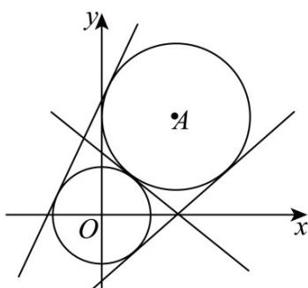

> [!faq]- 《专题04_直线与圆_圆与圆的位置关系的四大常考题型_高效培优专项训练_》官方解析
>
> > [!success]- **【答案】** C
>
> > [!note]- **【解析】**
> > 
> >
> > 如图，分别以 $O, A$ 为圆心，以 $2, 3$ 为半径画圆， $l$ 即为两圆的公切线，
> >
> > 因为 $|OA| = \sqrt{(3 - 0)^2 + (4 - 0)^2} = 5 = 2 + 3$
> >
> > 所以两圆外切，两圆有三条公切线，即满足条件的直线 $l$ 共有3条，
> >
> > 故选 **C**.
