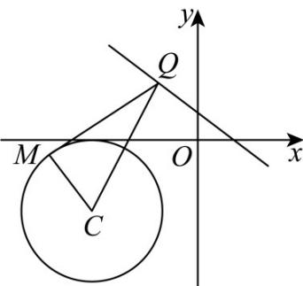

> [!faq]- 《专题04_直线与圆_圆与圆的位置关系的四大常考题型_高效培优专项训练_》官方解析
>
> > [!success]- **【答案】** C
>
> > [!note]- **【解析】**
> > 圆 C 的标准方程为 $(x+3)^{2}+(y+2)^{2}=4$ ，圆心为 $C(-3,-2)$ ，半径 r=2·
> > 圆心 C 到直线 l 的距离 $d=\frac{|3\times(-3)+4\times(-2)-3|}{\sqrt{3^{2}+4^{2}}}$ = 4，所以 A 不正确，B 不正确.
> > 从 Q 点向圆 C 引一条切线，设切点为 M，连接 CM, MQ, CQ，
> >
> > 
> >
> > 则 $CM \perp MQ$ ，则 $|MQ| = \sqrt{|CQ|^{2} - |CM|^{2}} = \sqrt{|CQ|^{2} - 4}$ ，当 $CQ \perp l$ 时， $|CQ|$ 取得最小值，此时 $|MQ|$ 取得最小值，即 $|MQ|_{\min} = \sqrt{4^{2} - 4} = 2\sqrt{3}$ ，故 C 正确，D 不正确。
> >
> > 故选 **C**.
